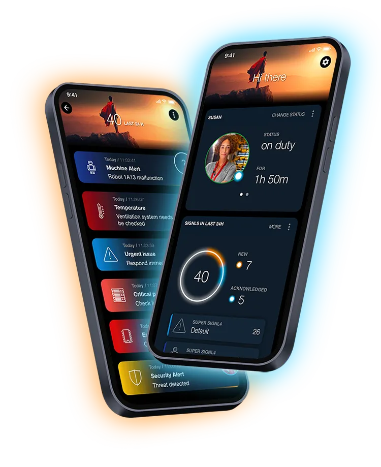

# What is SIGNL4

When critical systems fail, incidents happen or urgent services need to be provided, SIGNL4 bridges the ‘last mile’ to your staff, engineers, IT admins and workers ‘in the field’. It adds real-time mobile alerting to your services, systems and processes in no time. SIGNL4 notifies through persistent mobile push, text, email and voice calls with acknowledgement, tracking and escalation. Integrated duty and shift scheduling ensures the right people are alerted at the right time. SIGNL4 thus provides for an up to 10x faster and effective response to critical alerts, major incidents and urgent service requests.

## SIGNL4 Technical Docs

Here you find a selection of techical information and documentations about SIGNL4, including [integrations](/integrations/integrations.html).

For more information you can also go to [signl4.com](https://www.signl4.com).
