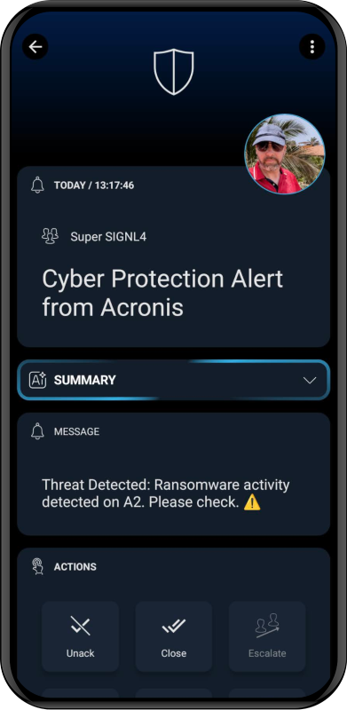

# SIGNL4 Integration with Acronis

[Acronis](https://www.acronis.com/en-us/) is a global leader in cyber protection, combining backup, disaster recovery, cybersecurity, and endpoint management to safeguard data across cloud, on-premises, and hybrid environments. Its innovative solutions help businesses ensure data integrity, security, and availability with AI-enhanced threat detection and blockchain-based authentication.

[SIGNL4](https://www.signl4.com/) offers critical alerting, incident management for operating critical infrastructure. It alerts you persistently via app push, SMS text, voice calls, and email including tracking, escalation, on-call duty scheduling and collaboration.

This article describes how to integrate SIGNL4 with Cyber Protect Cloud.

## Prerequisites

- A SIGNL4 ([https://www.signl4.com](https://www.signl4.com/)) account
- An Acronis ([https://www.acronis.com/en-us/](https://www.acronis.com/en-us/)) instance

## How to Integrate

Integrating SIGNL4 with Acronis is straightforward. You just need to configure email notifications in Acronis und use the SIGNL4 team email address there.

In order to get SIGNL4 to successfully monitor your Acronis Cyber Protect Cloud, you will need to login to your Acronis Cyber Protect Cloud portal and direct the email notifications to your SIGNL4 mailbox.

1\. From the root organization, create a new user.

2\. Add your SIGNL4 email address, leave the user as an Administrator, and create the user.

3\. Log in to your SIGNL4 mailbox and activate the account. You will choose a password after clicking the activation link.

It's best to open the link in incognito / private mode so you do not log yourself out of the account you started the setup with.

Note: The activation link can take up to 20 minutes to arrive to the inbox. If you do not know your mailbox password, please email support and we can reset it for you.

4\. Edit the created user and under settings, enable the three email notifications shown below.

For a visual walkthrough of this process, please check out Acronis' YouTube video on this: [Setting up Notifications - Acronis Cyber Backup Cloud](https://www.youtube.com/watch?v=OXd-IUHqVUI).

That’s it! Now, whenever an email notification is sent from Acronis, an alert is triggered in SIGNL4.

The alert in SIGNL4 might look like this.

