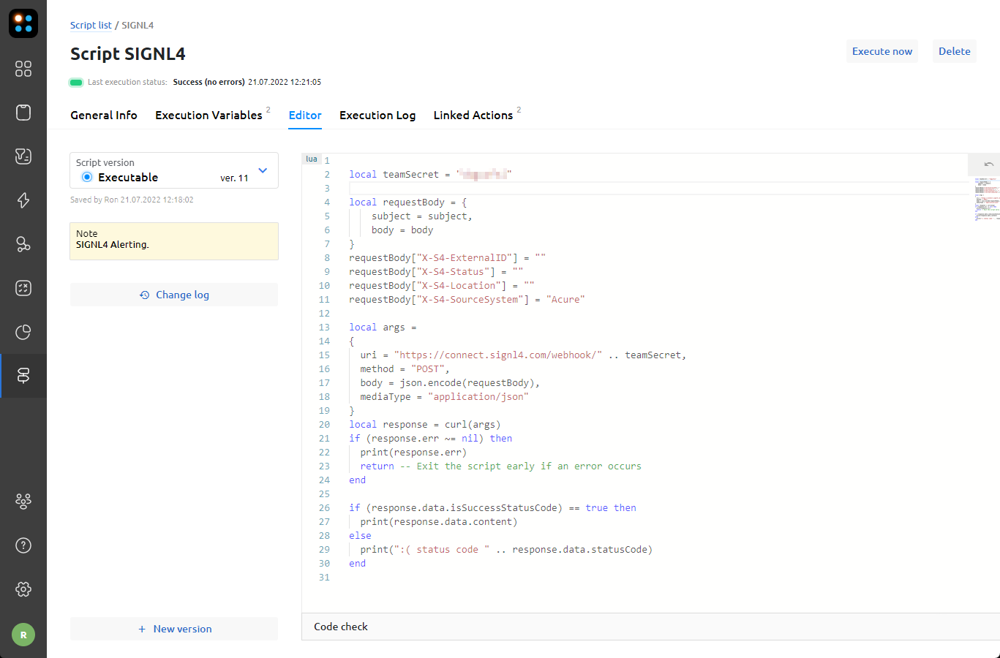
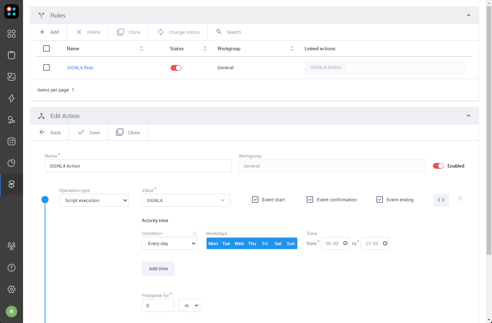

# SIGNL4 Integration with Acure

[Acure](https://acure.io/) is a leading all-in-one cloud-hosted AIOps observability and automation platform to increase your observability and automate remediation. There is a free version available, too.

You configure SIGNL4 alerting in the Acure web portal.

In the Acure portal under Actions -> My Scripts you add a new script like the one below. Here, {team-secret} needs to be replaced with your SIGNL4 team secret.

For closing alerts in SIGNL4 when the problem gets cleared in Acure you can modify the X-S4 parameters as described [here](https://www.signl4.com/blog/update-july-2020-resolve-alerts/).



Script:

```lua
-- SIGNL4 Webhook API: https://connect.signl4.com/webhook/docs/index.html

-- Specify your SIGNL4 team secret here
local teamSecret = "team-secret"

local requestBody = {
    subject = subject,
    body = body
}
-- External ID and Status can be used to close an alert in case the problem is cleared in Acure
requestBody["X-S4-ExternalID"] = ""
requestBody["X-S4-Status"] = ""
requestBody["X-S4-Location"] = ""
requestBody["X-S4-SourceSystem"] = "Acure"

local args =
{
  uri = "https://connect.signl4.com/webhook/" .. teamSecret,
  method = "POST",
  body = json.encode(requestBody),
  mediaType = "application/json"
}
local response = curl(args)
if (response.err ~= nil) then
  print(response.err)
  return -- Exit the script early if an error occurs
end

if (response.data.isSuccessStatusCode) == true then
  print(response.data.content)
else
  print(":( status code " .. response.data.statusCode)
end

```

You can adapt the parameters according to your needs.

Now you can setup a Rule and an Action under Actions -> Rules&Actions. The Action calls the above SIGNL4 script and the Rule specifies the conditions and then calls the Action.



This is it. Now your SIGNL4 team gets an alert each time Acure detects a critical problem.

The alert in SIGNL4 might look like this.


