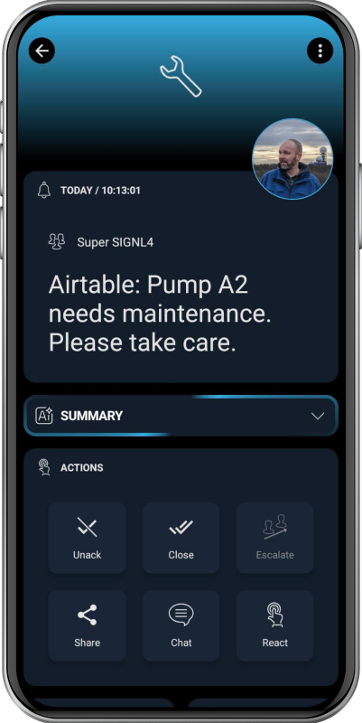

# SIGNL4 Integration with Airtable

[Airtable](https://www.airtable.com/) a cloud-based platform that combines the features of a spreadsheet with the functionality of a database, offering a flexible and visually appealing way to organize, manage, and collaborate on data. It's essentially a no-code platform that allows users to build custom applications and databases without needing to write any code.

SIGNL4 adds reliable mobile alerting to Airtable with features like mobile app, push notifications, SMS messaging, voice calls, automated escalations, and on-call duty scheduling. SIGNL4 ensures that critical alerts reliably reach the responsible personnel – anytime, anywhere.

## Prerequisites
A SIGNL4 (https://www.signl4.com) account
An Airtable (https://www.airtable.com/) account

## How to Integrate

The integration of SIGNL4 with Airtable is straightforward and can be done using an Automation that sends an email to your SIGNL4 email address.

In our example, we trigger SIGNL4 alerts in case a table record gets a "New" status.

This is how our table looks like.


Now, we need an Automation. In your Airtable workspace, go to Automation and create a new automation. Add a suitable trigger, e.g. "When a record matches conditions" and specify the conditions accordingly. For example, the condition might be that a certain field contains a certain text, e.g. field "Status" contains "New".

As action you choose "Send an email" where in the "To" field you enter your SIGNL4 email address. Subject and message contain the texts of the SIGNL4 alert. You can use place holders here.

To display the parameters nicely in SIGNL4 you can use the following formatting for the message text:

```
Message: {Name}
Notes: {Notes}
```


You can test and save the automation, and it will then send a SIGNL4 alert every time a new record matches the specified condition.

With no-code tools like Make or n8n you can even create powerful two-way integrations and multi-step alerting workflows involving Airtable.

The alert in SIGNL4 might look like this.


