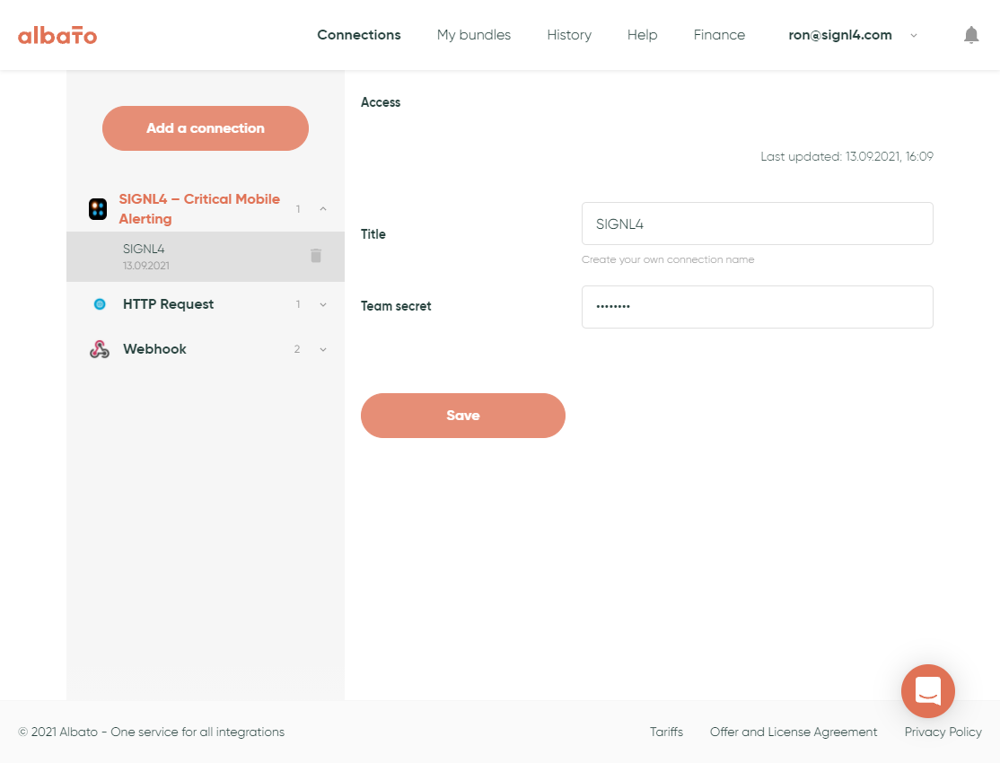
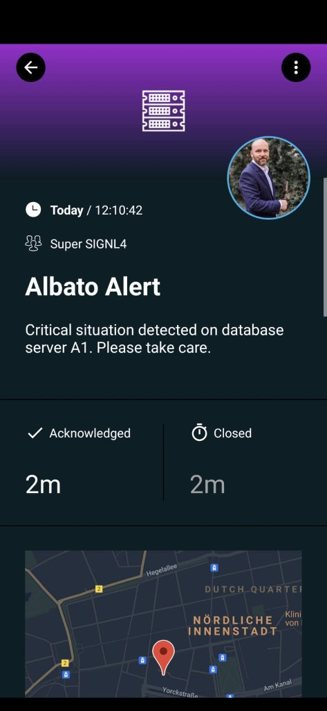

# SIGNL4 Integration with Albato

SIGNL4 is a mobile alert notification app for powerful alerting, alert management and mobile assignment of work items. Get the app at [https://www.signl4.com](https://www.signl4.com/).

In the following sample workflow below we send information from a HTTP request to SIGNL4.

## SIGNL4 Connection

Fist, under Connections you need to create a new SIGNL4 connection, give it a name and enter your SIGNL4 team secret.

## User SIGNL4 in your Bundle

Now you can use the SIGNL4 actions in your bundles. There are two actions available, one for sending alerts (“Send alert”) and one for resolving / closing alerts (“Resolve alert”).

You can add the parameters within the action. In order to resolve / close and alert the parameter “SIGNL4 External ID” in the “Resolve alert” action needs to be the same as for the previously called “Send alert” action.

The alert in SIGNL4 might look like this.

