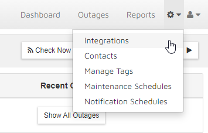
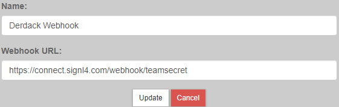
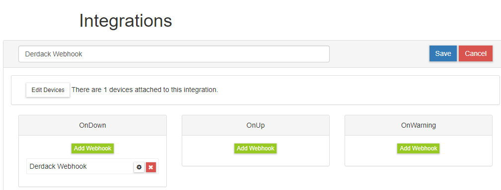
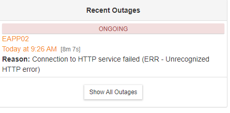
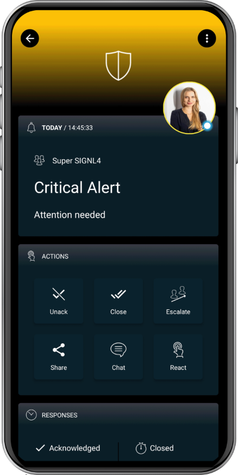

# SIGNL4 Integration with Alertra

[Alertra’s](https://www.alertra.com/) easy to use website monitoring service, including phone and SMS alerts, keeps you in the know when it comes to website outages or slowdowns. They check your websites, website uptime, servers and routers from all around the world to verify they’re working as they should.

In our example we are using Alertra to monitor the up-time of critical servers.  We are forwarding website down alerts via webhook to our SIGNL4 team.

SIGNL4 is a mobile alert notification app for powerful alerting, alert management and mobile assignment of work items.  Get the app at [https://www.signl4.com](https://www.signl4.com/).

## Prerequisites

- A SIGNL4 ([https://www.signl4.com](https://www.signl4.com/)) account
- An Alertra ([https://www.alertra.com/](https://www.alertra.com/)) account

## How to Integrate

Let’s customize a webhook integration within Alertra to make sure that we are sending an alerts that are raised to our SIGNL4 team. From the Main Menu, select Alerts and then choose Integrations.  From the system icon select integrations.

Click Create New Integration on the next page and populate the OnDown section. For our example we selected the Slack integration option and changed the Name and URL to match the SIGNL4 webhook.

Ensuring that the device is selected along with the newly created webhook integration will then alert SIGNL4 on-call duty members when a device is unreachable.

That’s it!  Alerts will be notified to your SIGNL4 team.

The alert in SIGNL4 might look like this.

