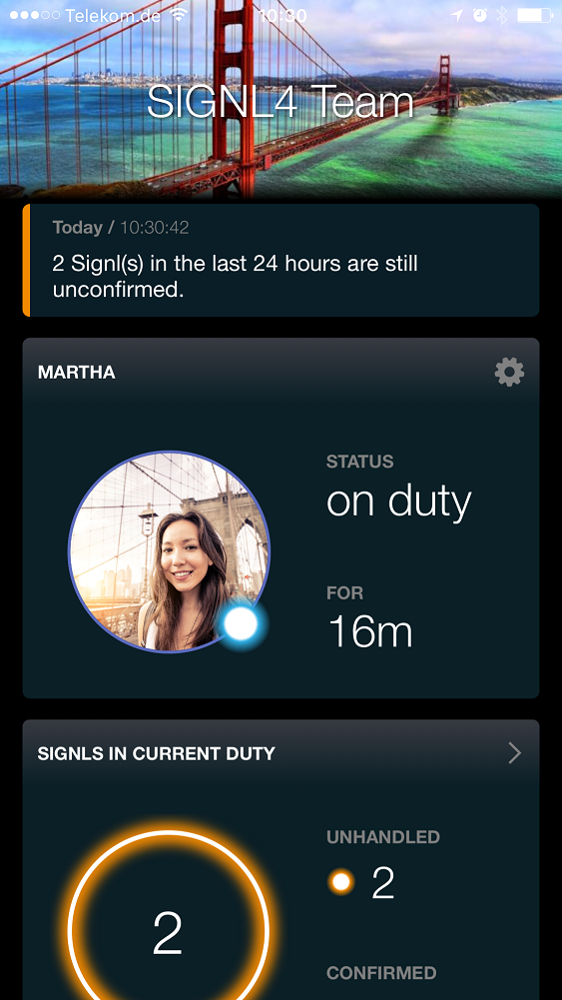

# SIGNL4 Integration with Amazon Alexa

SIGNL4 has a native [Amazon Alexa](https://developer.amazon.com/alexa?cid=a) app to provide a conversational interface to interact, manage and use SIGNL4.

Go to the [Alexa app listing](https://www.amazon.com/Derdack-GmbH-SIGNL4/dp/B077BQ79T3) on Amazon.

With Amazon Alexa, the Internet giant, Amazon, has quickly established itself as a leading company in the field of digital assistants with speech recognition.

We here at Derdack SIGNL4 believe that speech recognition will play an enormously important role in the near future in all areas of life and business. In connection with mobile alarming, we see application areas such as alert notifications in medical emergencies and in hospitals, in personal safety and security, in controlling machines and systems, etc. That’s why we started early on with the integration of digital assistants. With the [SIGNL4 Skill for Amazon Alexa](https://www.amazon.com/Derdack-GmbH-SIGNL4/dp/B077BQ79T3) we have developed a first variant of voice control for a business application.

## The Amazon Alexa SIGNL4 Skill

The SIGNL4 Skill can be used to trigger alarms for your own team, acknowledge alarms and manage your own on-call service. Here is a short demonstration video to trigger a simple alarm.

## How does it work?

First you need an account at SIGNL4. Just download the app and register by email. You will then receive a password from SIGNL4. If necessary, invite other people to join the team so that you are not the only one to be alerted. If you already got Alexa, just go to the Alexa App and search for “SIGNL4”. Then activate the skill. Alexa then prompts you to log in to the SIGNL4 portal and grant Alexa access to your SIGNL4 data. Then you are good to go and to explore how to control SIGNL4 by voice with Amazon Alexa.

Just say to Alexa “Alexa, open SIGNL4” (“signal four”).

## Test drive now

You can test SIGNL4 immediately and free of charge. Just download the app and register.

Please watch our Integration Video:
<iframe width="560" height="315" src="https://www.youtube.com/embed/LKm4-PbvSFY?si=GhIIh0GQX7I_H8aG" title="YouTube video player" frameborder="0" allow="accelerometer; autoplay; clipboard-write; encrypted-media; gyroscope; picture-in-picture; web-share" referrerpolicy="strict-origin-when-cross-origin" allowfullscreen></iframe>
