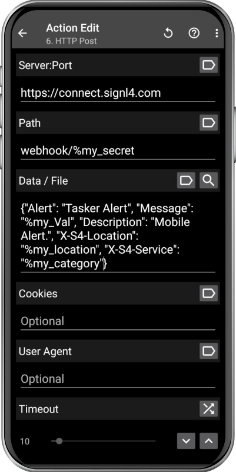

# SIGNL4 Integration with Android

Of course, Android smartphones and iPhones typically serve as the user’s primary devices for receiving SIGNL4 alerts. However, Android devices can do more than just receive alerts – they can also initiate them.

Users can manually trigger alerts directly from the SIGNL4 mobile app on their Android phones. But that’s just one option. Android also offers additional convenient ways to initiate alerts: you can create home screen shortcuts for one-tap alerting, design custom alert forms, or even take a photo and send it as part of an alert via SIGNL4.

Android devices can also trigger SIGNL4 alerts automatically. Modern smartphones are equipped with a wide range of built-in sensors, enabling automated alerting based on various conditions. For example, alerts can be sent when certain sensor thresholds are reached, when the user is inactive for a specific period, upon entering or leaving predefined geofenced areas, and much more.

[SIGNL4](https://www.signl4.com) sends actionable mobile alerts to the responsible users or teams. It provides a powerful set of features including a mobile app, push notifications, SMS, voice calls, automated escalations, and duty scheduling. This ensures that critical alerts are delivered instantly and reliably to the right people – anytime, anywhere.

## Prerequisites

- A SIGNL4 ([https://www.signl4.com](https://www.signl4.com/)) account
Either of the following Android apps  
- [Automate](https://play.google.com/store/apps/details?id=com.llamalab.automate)
- [HTTP Request Shortcuts](https://play.google.com/store/apps/details?id=ch.rmy.android.http_shortcuts)
- [MacroDroid - Device Automation](https://play.google.com/store/apps/details?id=com.arlosoft.macrodroid)
- [Tasker](https://play.google.com/store/apps/details?id=net.dinglisch.android.taskerm)

## Use Cases

There are countless possible use cases – here are just a few ideas:

- Create custom forms to send alerts with required information
- Set up shortcuts for sending predefined alerts
- Scan a QR code on a shelf to request spare parts
- Let security personnel scan NFC tags as control points during night rounds
- Send alerts with a photo and GPS location, e.g. for a leaking pipe
- Use a simple deadman switch to alert on user inactivity
- Trigger alerts if a phone is out of coverage, turned off, or damaged (via heartbeats)
- Enable geofencing alerts when a device enters or leaves a defined area (using GPS, Wi-Fi, or cell towers)
- And much more...

## How to Integrate

You can easily integrate the above mentioned apps by using the [SIGNL4 webhook API](https://docs.signl4.com/integrations/webhook/webhook.html).

You can use the app’s HTTP request action to send an HTTP POST request to your SIGNL4 webhook URL. This triggers an alert in SIGNL4. Simply embed this step into any workflow to achieve your desired outcome.

This is how the HTTP Post action for triggering a SIGNL4 alert looks like in Tasker:

This is a sample flow for SIGNL4 geo-fencing alerts in Automate.

The alert in SIGNL4 might look like this.

