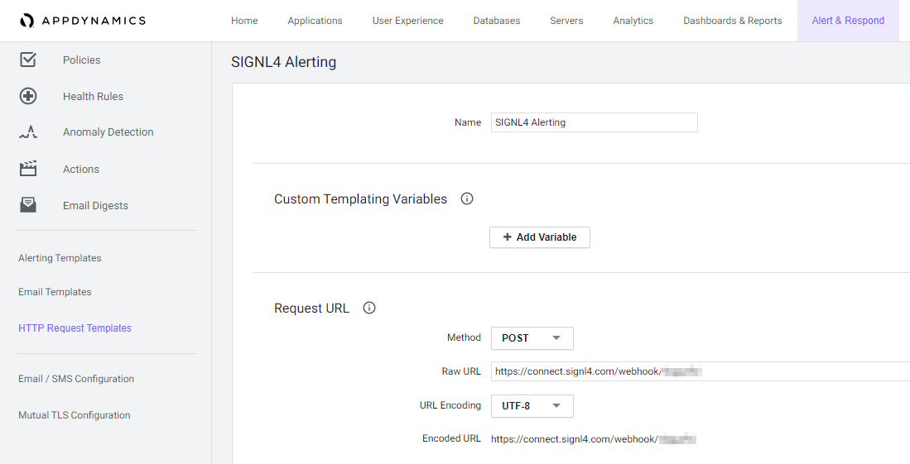
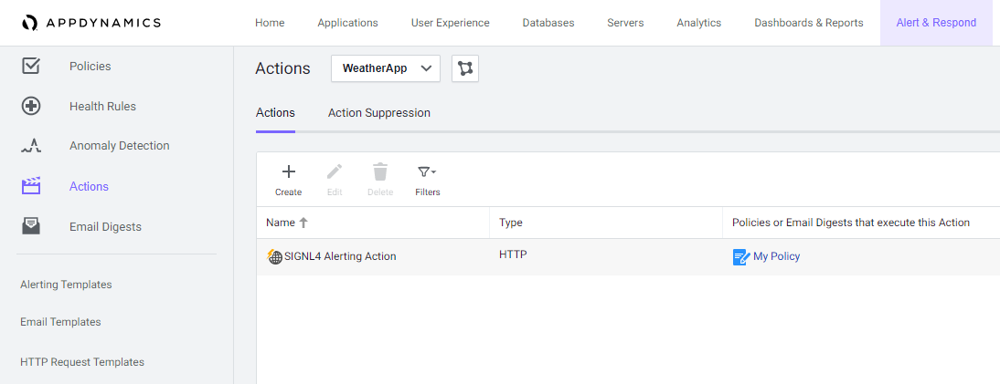

# SIGNL4 Integration with AppDynamics

[AppDynamics](https://www.appdynamics.com/) agents sit across your entire application ecosystem and supporting infrastructure, notifying controllers of real-time performance. Agents send performance data to controllers, and your application performance is visualized through the controller UI. These data collectors and analytics are great for users sitting at the control desk.

Once you have the AppDynamics agents installed throughout your network, the controller is going to be receiving data collected from those agents.  Editing the Alert Policy Actions to direct communication to your SIGNL4 team is the only configuration that you need to start receiving real time alerts.

The first step in integrating the AppDynamics with SIGNL4 is to create a new HTTP Request Template. From the AppDynamics web portal click on Alerts & Respond and then select HTTP Request Template and create a new template.



The Method is POST and the Raw URL is your SIGNL4 webhook URL including your team secret.

The Payload (MIME Type application/json) might look like follows.

```json
{
  "Subject": "${latestEvent.displayName} on ${latestEvent.node.name}",
  "Summary": "${latestEvent.summaryMessage}",
  "Message": "${latestEvent.eventMessage}",
  "incident_key": "${latestEvent.node.name} - ${latestEvent.application.name}",
  "event_type": "${pd_event_type}",
  "client_url": "${controllerUrl}",
  "Event Name": "${latestEvent.displayName}",
  "Event ID": "${latestEvent.id}",
  "GUID": "${latestEvent.guid}",
  "Event Time": "${latestEvent.eventTime}",
  "Event Type": "${latestEvent.eventType}",
  "Event Type Key": "${latestEvent.eventTypeKey}",
  "Application Name": "${latestEvent.application.name}",
  "Node Name": "${latestEvent.node.name}",
  "Severity": "${latestEvent.severity}",
  "X-S4-ExternalID": "${latestEvent.node.name} - ${latestEvent.application.name}",
  "X-S4-Status": "new",
  "X-S4-SourceSystem": "AppDynamics"
}
```

You can adapt it according to your needs.

Now you need to create a new Action under Alert & Respond. Make sure that you select your SIGNL4 HTTP Request Template from the previous step.



Finally, under Alert & Respond -> Policies you create a new Policy or edit an existing one. You specify the Trigger criteria for the SIGNL4 alert.  
Under Actions you select the SIGNL4 action you created earlier.


## Close Alerts

You can also create a second policy to close existing alarms. To do this, you specify the OK criteria in the trigger and trigger an action that sets the “X-S4-Status” parameter in the payload to “resolved”. The parameter “X-S4-ExternalID” must be the same as for the previously triggered alert that is now to be closed.

That’s it. The next time a policy is triggered your SIGNL4 team will be alerted.

The alert in SIGNL4 might look like this.


