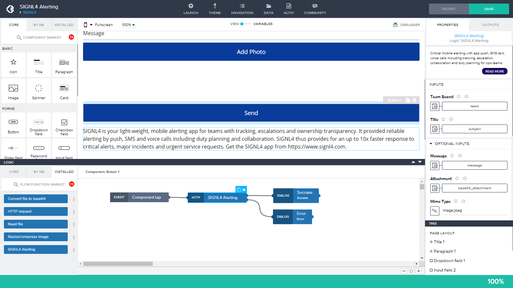
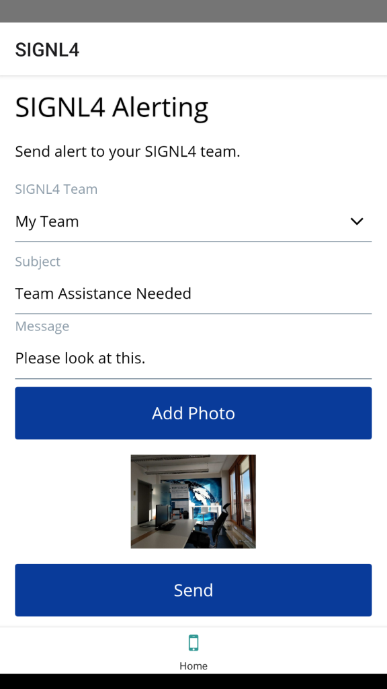

# SIGNL4 Integration with SAP Appgyver

The integration of SIGNL4 with AppGyver is possible via a SIGNL4 Flow Function. This can be added directly from the Marketplace.

Now you can use the SIGNL4 Flow Function. At least the following input parameters are required:
- Team Secret| SIGNL4 team secret.
- Title: Alarm Title.
- Message: Alarm message.

## Test the App

After you have created your app you can easily test it in the mobile AppGyver app.

The possibilities are as versatile as your requirements and your imagination.

The alert in SIGNL4 might look like this.

