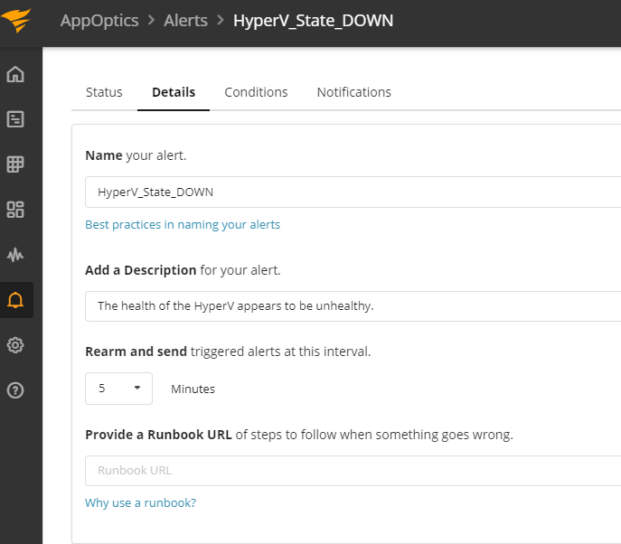

# SIGNL4 Integration with AppOptics

[AppOptics](https://www.appoptics.com/) is a hybrid monitoring service from SolarWinds. Performance monitors are easy to configure, and notifications channels are configured with just a few clicks.  SIGNL4 ensures that all on duty members receive, acknowledge and resolve critical alerts, all from their smartphones. With persistent notifications and escalation chains there will never be a critical alert that goes unattended.

In our example we are using AppOptics to monitor the heartbeat of critical servers.  We are setting up a webhook to send alerts to the SIGNL4 team when the server is unreachable.

SIGNL4 is a mobile alert notification app for powerful alerting, alert management and mobile assignment of work items.  Get the app at [https://www.signl4.com](https://www.signl4.com/)

## Prerequisites

- A SIGNL4 ([https://www.signl4.com](https://www.signl4.com/)) account
- An AppOptics ([https://www.appoptics.com/](https://www.appoptics.com/)) account

We will create a new rule that monitors the health of a Virtual Machine. Upon creating the rule, set the Name and Description of the alert.

On the Conditions tab set the policy rules in which need to be met to trigger the alert.

![AppOptics Create Alert 2]appoptics-create-alert-2.png)

Finally, the notifications tab – this is where SIGNL4 comes in. You can choose to add an email channel using the SIGNL4 team email.  Alternatively, you can configure a Webhook and simply putting in the team specific webhook URL will forward the data to SIGNL4.

Now whenever the VM server is unreachable an alert will trigger within AppOptics and send the event data to SIGNL4 via a JSON Post.  Customized messages are available within the alert policy.  SIGNL4 will receive the parameters and separate it out in an easy to read format.

Alerts can be augments so that the appropriate color, icon and message is displayed within the mobile app. This is done in the Services & Systems section of the mobile app settings.

The alert in SIGNL4 might look like this.

