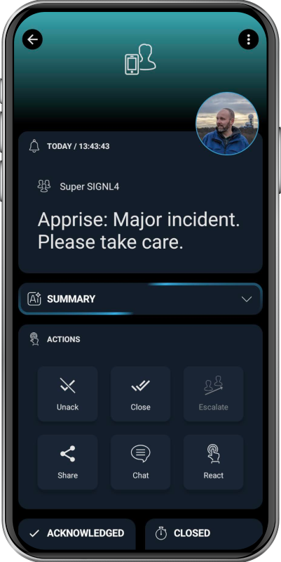

# SIGNL4 Integration with Apprise

[Apprise](https://github.com/caronc/apprise) is a lightweight notification library that supports sending messages to a wide range of popular notification services like Telegram, Slack, Discord, and SIGNL4 using a common and intuitive syntax. It allows developers and system administrators to easily send notifications without needing to research or adapt to each individual service.

[SIGNL4](https://www.signl4.com) sends actionable mobile alerts to the responsible users or teams. It provides a powerful set of features including a mobile app, push notifications, SMS, voice calls, automated escalations, and duty scheduling. This ensures that critical alerts are delivered instantly and reliably to the right people – anytime, anywhere.

## Prerequisites

- A SIGNL4 ([https://www.signl4.com](https://www.signl4.com/)) account
- Apprise ([https://github.com/caronc/apprise](https://github.com/caronc/apprise)) installed

## How to Integrate

Install Apprise as described [here](https://github.com/caronc/apprise). For sending SIGNL4 alerts you can use the Apprise SIGNL4 URL for SIGNL4. For more infornation see the documentation [here](https://github.com/caronc/apprise/wiki/Notify_signl4).

### Syntax
Valid syntax is as follows:
* `signl4://{secret}`

### Parameter Breakdown
| Variable    | Required | Description
| ----------- | -------- | ----------- |
| service | No      | Assigns the alert to the service/system category with the specified name. |
| location | No       | Transmit location information (‘latitude, longitude’) with your event and display a map in the mobile app. |
| alerting_scenario | No      | If this event triggers an alert, allows to control how SIGNL4 notifies the team. **single_ack**: Only one person needs to acknowledge this alert. **multi_ack**: The alert must be confirmed by the number of people who are on duty at the time this alert is created. **emergency**: All people in the team are notified regardless of their duty status and must acknowledge the alert, which is also assigned to the built-in emergency category. |
| filtering | No      | Specify a boolean value of true or false to apply event filtering for this event, or not. If set to true, the event will only trigger a notification to the team, if it contains at least one keyword from one of your services and system categories (i.e. it is whitelisted). |
| external_id | No      | If the event originates from a record in a 3rd party system, use this parameter to pass the unique ID of that record. That ID will be communicated in outbound webhook notifications from SIGNL4, which is great for correlation/synchronization of that record with the alert. |
| status | No      | If you want to resolve an existing alert by an external id (external_id), you can add this status parameter. It has three possible values: **new**: Default value which means that this event triggers a new alert. **acknowledged**: If you want to acknowledge a previously triggered alert (e.g. someone responded in the 3rd party system and not in the mobile app during business hours), set the "status" to "acknowledged" and provide an external ID via the "external_id" parameter for the alert you want to acknowledge. It is only possible to acknowledge an alert with a provided external id that initially triggered it. **resolved**: If you want to resolve a previously triggered alert (e.g. monitoring system has auto-closed the event), make sure to set the X-S4-Status to ‘resolved’ and provide an external ID via the "external_id" parameter for the alert(s) you want to resolve. It is only possible to resolve a alert with a provided external id that initially triggered it. |

You can find more information [here](https://docs.signl4.com/integrations/webhook/webhook.html).

### Example

Sends simple SIGNL4 alerts

```bash
apprise -vv --title 'Alert from Apprise' --body 'Hello world.'
```

```bash
apprise -vv --title 'Alert from Apprise' --body 'Hello world.' 'signl4://secret?service=IoT&location=52.3984235,13.0544149&external_id=a2&status=new'
```

The "secret" is your SIGNL4 team or integration secret.

The alert in SIGNL4 might look like this.



