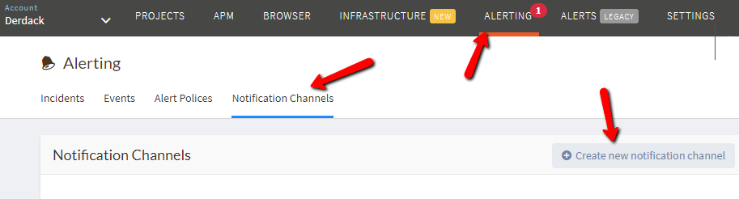
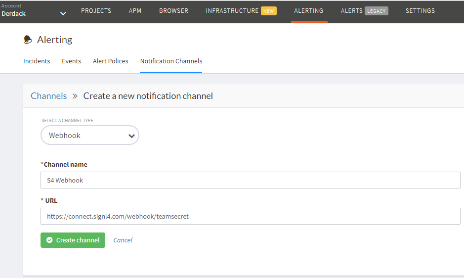
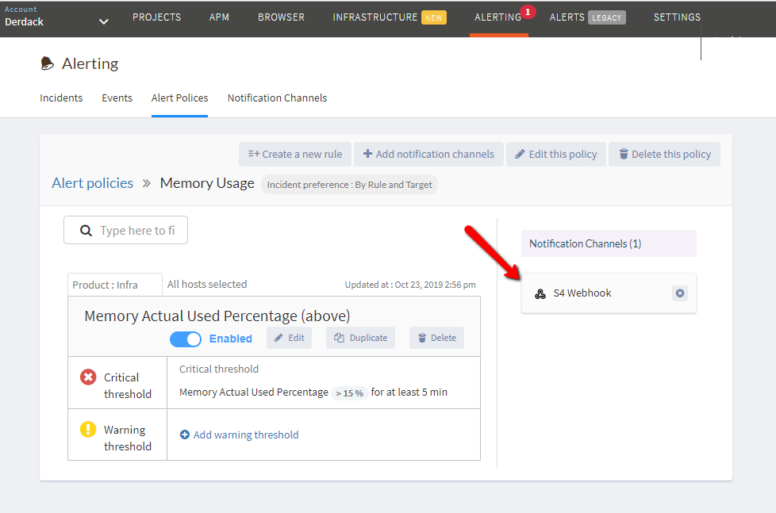

# SIGNL4 Integration with Atatus

SIGNL4 completes the last mile between your infrastructure monitor and the on-call duty members tasked to resolve critical issues. [Atatus](https://www.atatus.com/) monitors the health of your servers and hosts in real-time. Identify the hosts, processes that consume the most memory and CPU, analyze the load averages, disk usage and I/O wait times.  When these thresholds reach critical limits, SIGNL4 will deliver the notifications via Push, SMS and Voice.

In our example we are using Atatus to monitor server metrics of application servers.  We are forwarding notifications to the SIGNL4 webhook address to generate the alerts.

SIGNL4 is a mobile alert notification app for powerful alerting, alert management and mobile assignment of work items.  Get the app at [https://www.signl4.com](https://www.signl4.com/)

## Prerequisites

- A SIGNL4 ([https://www.signl4.com](https://www.signl4.com/)) account
- An Atatus ([https://www.atatus.com](https://www.atatus.com/)) account

First we will create the notification channel. Go to Alerting -> Notification Channel -> Create New Notification Channel.

Enter your custom webhook URL into the URL text box.

Next edit an existing alert policy and select the SIGNL4 webhook you just created.

The next time the alert policy triggers, the SIGNL4 team will receive the alert. You can augment the text, color and icon in the Services & Systems option within the mobile app.

The alert in SIGNL4 might look like this.

