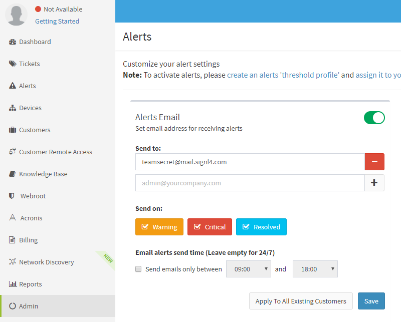

# SIGNL4 Integration with Atera

[Atera](https://www.atera.com/) is a hybrid  IT monitoring system for servers, applications, websites and networks.  The monitoring dashboard gives a great overview of your setup but where SIGNL4 comes in is at the alerting level.  Currently Atera will send an email to specified parties when a new ticket is raised.  SIGNL4 allows for those emails to be directed to the right people at the right time.  With on-call duty scheduling and a tiered escalation to a manager, SIGNL4 ensures that the email will not be lost in a sea of emails.

In our example we are going to forward Atera ticket via email to the SIGNL4 email address.  This will alert all team members on duty via Push, SMS and Voice notifications.

SIGNL4 is a mobile alert notification app for powerful alerting, alert management and mobile assignment of work items.  Get the app at [https://www.signl4.com](https://www.signl4.com/)

## Prerequisites

- A SIGNL4 ([https://www.signl4.com](https://www.signl4.com/)) account
- An Atera ([https://www.atera.com/](https://www.atera.com/)) account

Once you have all the monitors set in place for the various agents that you have installed, you only need to set the SIGNL4 team email address in the alert notification center.  This contact will notify your SIGNL4 team.  Select Admin on the left and enter the email address under alerts.

This will then send all tickets and raised alerts to the SIGNL4 team.

That’s it!

The alert in SIGNL4 might look like this.

