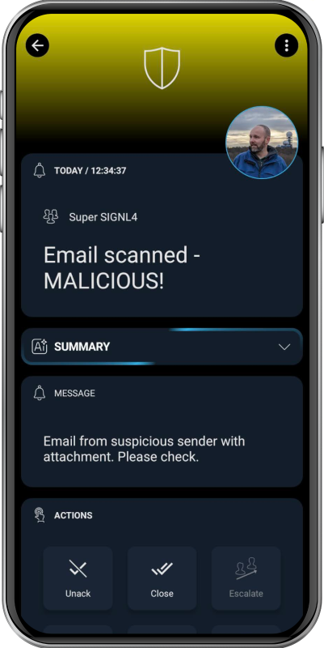

# SIGNL4 Integration with Atomatik

[Atomatik](https://www.atomatik.com/) is a workflow automation platform that uses digital SOC analyst agents to automate security alert investigations and triage, patch management and other manual cybersecurity operations, enabling security teams to respond faster and reduce alert fatigue.

The integration between Atomatik and SIGNL4 transforms how security teams respond to threats. Atomatik brings to the table customizable decision-ready reports at user’s fingertips, enriched with actionable details about threats that have been detected across systems. SIGNL4 capabilities help expand Atomatik’s already robust alert system into real-time mobile and voice channels including mobile app, escalations, on-call scheduling and collaboration. Integrating with SIGNL4 enables end users to evaluate and, if needed, remediate alerts immediately, from their mobile phones or offsite laptops.

## Prerequisites
- A SIGNL4 (https://www.signl4.com) account
- An active Atomatik (https://www.atomatik.com/) environment

## Core Integration Features

**Decision-ready alerts**  
Alert users instantly via mobile app push, SMS or voice call with detailed decision-ready threat reports.

**Smart Resource Management**  
Ability to focus on high-priority threat alerts, instead of wasting resources by escalating false positives to cybersecurity engineers.

**Voice Calls**  
Trigger automated phone calls for high-priority incidents.

**Fallback Channels**
Ensure alerts get through even if email or SMS is missed, including escalations.

**Persistent Escalation**  
Continue alerting until acknowledged by a human agent.

## Benefits for Users

**Real-Time Multichannel Notifications**  
Never miss a critical alert, reach your team wherever they are.

**24/7 Threat Awareness Without Human Dependency**  
Atomatik runs autonomously around the clock. SIGNL4 extends that coverage to human analysts by ensuring they're informed instantly.

**Safer Environments**  
Atomatik’s decision-ready reports, delivered instantly via SIGNL4, provide precise threat context that enables faster, more accurate responses, and strengthen security posture.

**Minimized Downtime**  
React faster to outages or breaches by mobilizing response teams without delay.

**Peace of Mind**  
Know that critical issues will always be delivered through persistent and reliable channels.

## How to Integrate

The integration of SIGNL4 with Atomatik is straightforward. This is how it works.

1. Atomatik detects a critical event and triages it automatically.
2. A decision-ready report is created.
3. Through API or webhook configuration, SIGNL4:
  - Sends enriched alerts via mobile app
  - Places phone calls
  - Broadcasts notifications via Alexa or other smart devices

For integration SIGNL4 with Atomatic please follow these steps you just need to configure Atomatik to connect to SIGNL4’s endpoint (via Studio task or control room trigger).

The alert in SIGNL4 might look like this.

