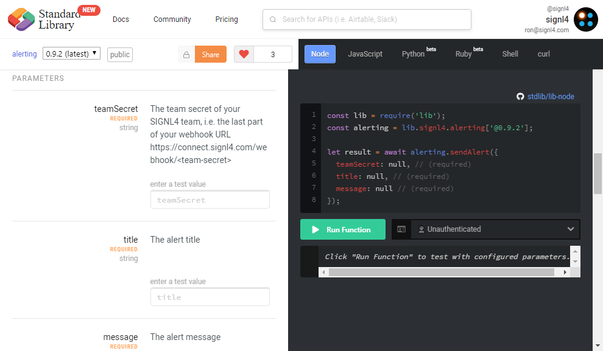
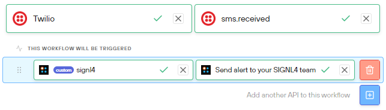
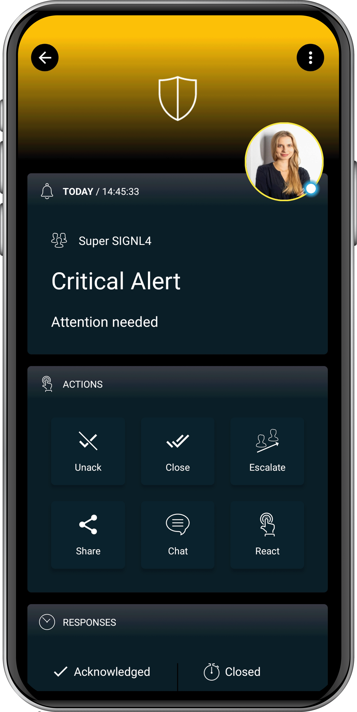

# SIGNL4 Integration with Autocode

## HOW TO INTEGRATE

You can find the SIGNL4 API at Autocode [here](https://autocode.com/signl4/api/).

You can use this API to easily integrate reliable alerting of SIGNL4 teams into your workflows.

The alert in SIGNL4 might look like this.

