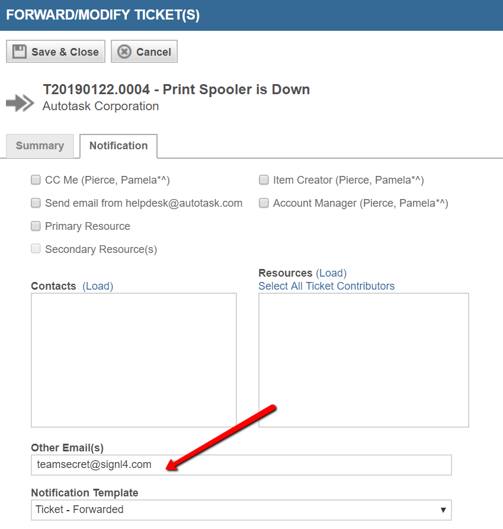
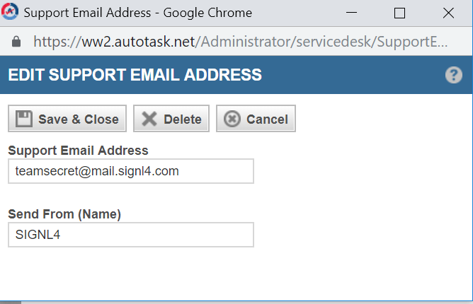
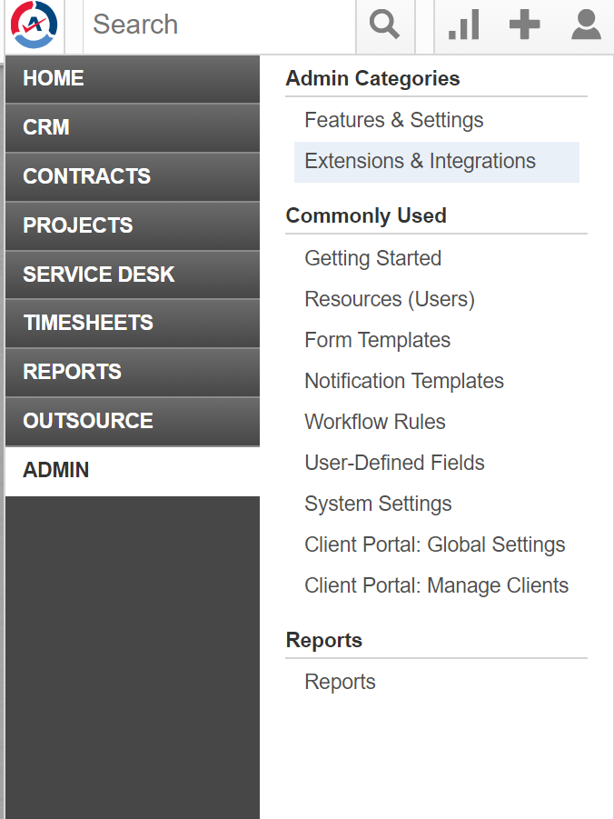
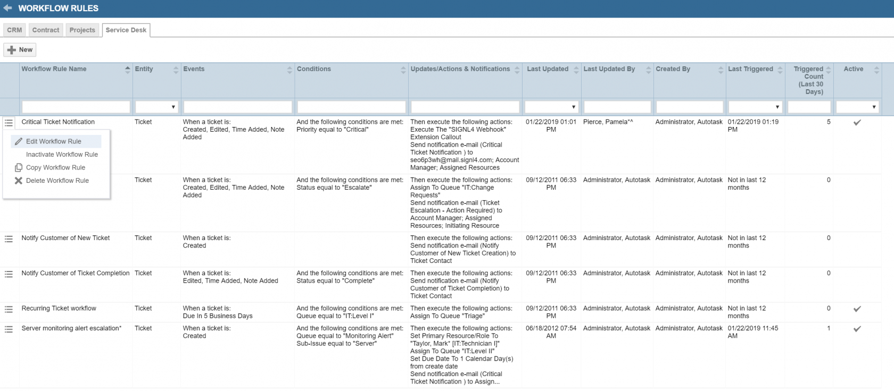
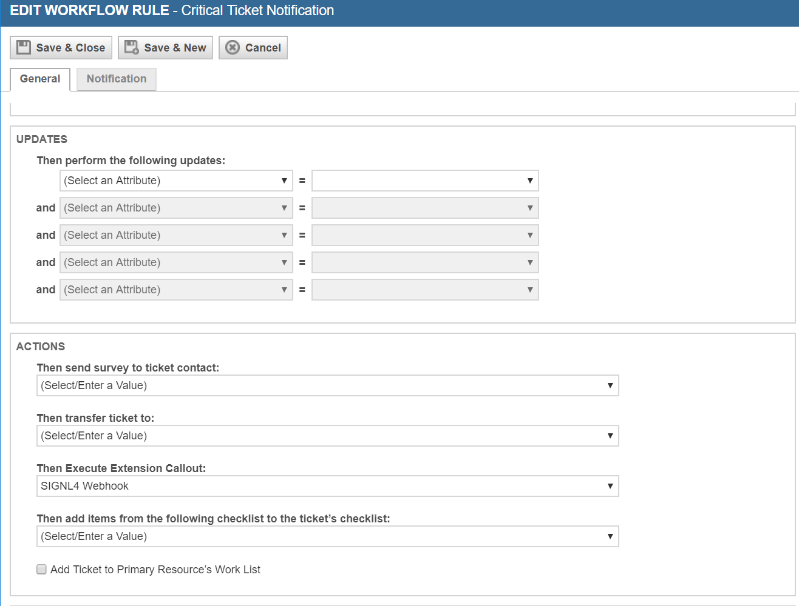

# SIGNL4 Integration with Autotask

You can configure the Autotask integration with SIGNL4 as follows.

## Connector App

## Simple Email Integration

Using the email integration you can forward any ticket to your SIGNL4 team for a quick response and resolution to an open issue.

Open the ticket and click on the Forward icon at the top.

Select the Notification tab.

Input the SIGNL4 team email address in the other Email(s) section.

Click Save & Close.

## Simple Webhook Integration

Configuring a webhook URL and assigning it to a Workflow will ensure automatic delivery of ticket information to your SIGNL4 team.

From the Admin Menu select Extension and Integrations.

Select Other Extensions and Tools.

Click on Extension Callout (Tickets).

Add New Extension Callout.

From the GENERAL TAB:
- Give it a name
- Insert the SIGNL4 webhook URL

HTTP Method should be set to POST:
- Data Format should be XML
- Click Save and Close

**Editing WorkFlow Rules** 

From the Admin Menu select Workflow Rules.

Edit the rule that you wish to go out for alerting (such as Critical Ticket Notification).

Under Actions Select the drop down menu in Then Execute Extension Callout.

Select SIGNL4 Webhook.

Click Save.

