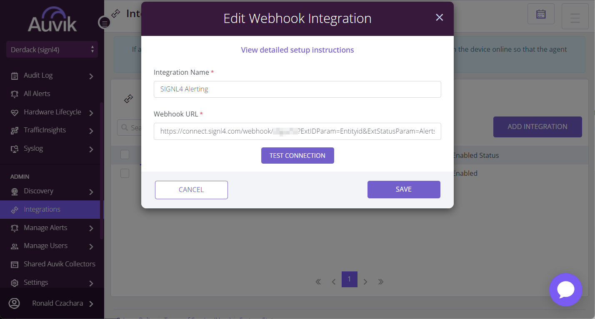
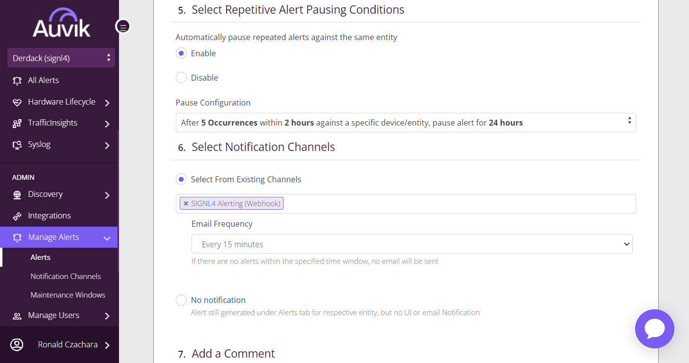
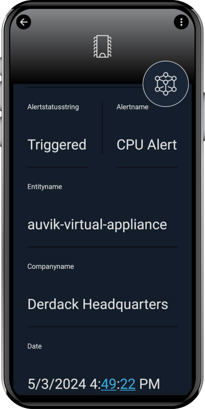

# SIGNL4 Integration with Auvik

[Auvik](https://www.auvik.com/) is cloud-based network management software for IT departments and MSP's. It allows you to discover and map all the devices on your network in a matter of minutes.

You can configure the Auvik integration with SIGNL4 as follows.

## Prerequisites

- A SIGNL4 account ([https://www.signl4.com](https://www.signl4.com/))
- An Auvik instance ([https://www.auvik.com](https://www.auvik.com/))

## How to Integrate

We use the SIGNL4 webhook API to trigger and to close alerts in SIGNL4. 

### Integration

In your Auvik portal go to Admin -> Integrations and create a new Webhook integration.



As Webhook URL you can use your SIGNL4 webhook URL as follows:

```
https://connect.signl4.com/webhook/{team-secret}?ExtIDParam=Alertname&ExtStatusParam=Alertstatusstring&ResolvedStatus=Cleared
```

Replace {team-secret} with your SIGNL4 team secret.

The above URL including parameters makes sure to trigger the SIGNL4 alert but also to close the alert again if the status in Auvik becomes Cleared.

### Notification Channel

Now, we need a notification channel that is using the SIGNL4 integration we have created above. In order to create one go to Admin -> Manage Alerts -> Notification Channels and create a new notification channel. The Contact Method is Webhook and you can then select the SIGNL4 integration from the step above.


### Alerts

You can now configure your alerts under Admin -> Manage Alerts. You can add a new alert or edit an existing one here and specify your severity, entities, and conditions accordingly. As notification channel you select the SIGNL4 notification channel from above.



That's it, and if an alert is triggered in Auvik you will now receive this alert in SIGNL4.

This is it and an incoming alert will look like this.


