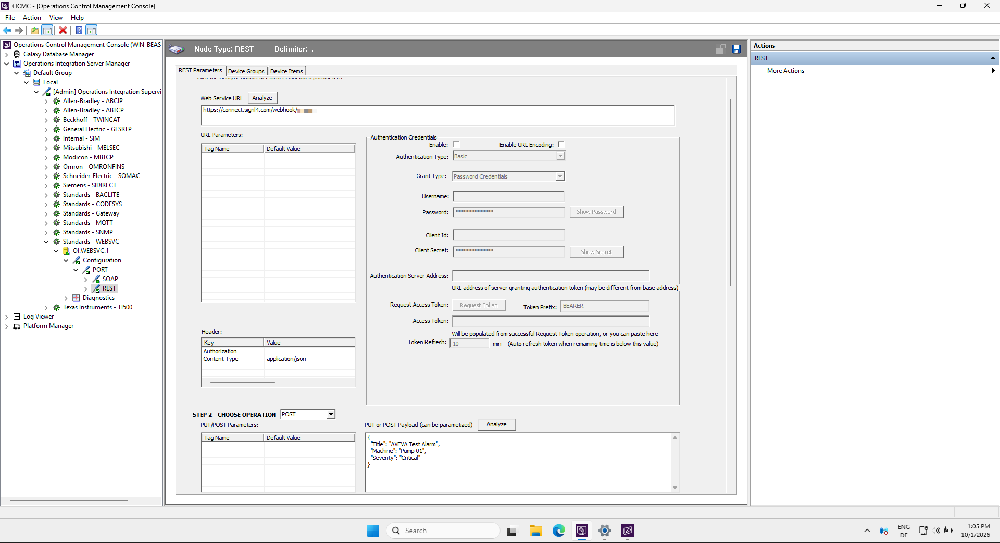
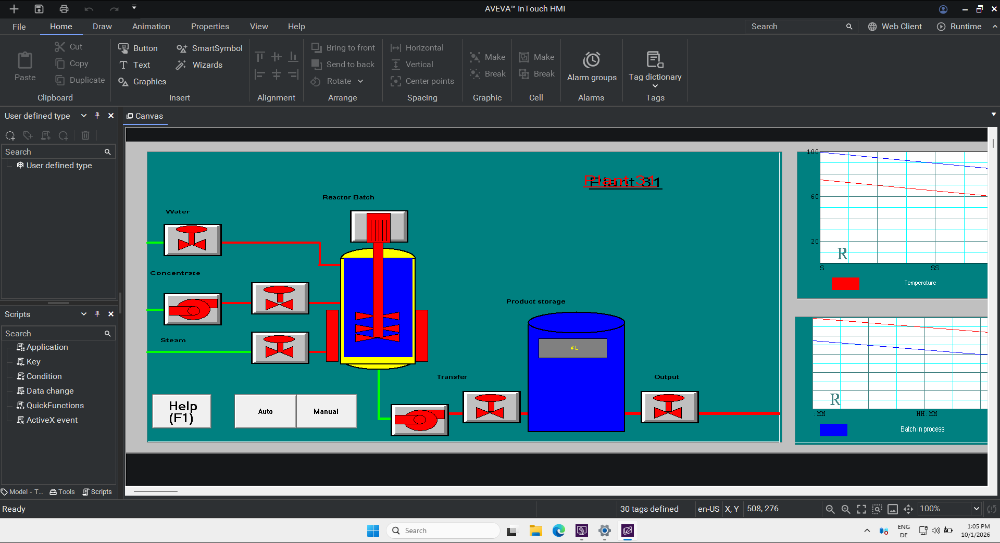
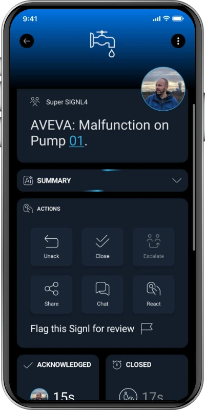

# SIGNL4 Integration with AVEVA

[AVEVA](https://www.aveva.com/) provides industrial software for HMI, SCADA, operations management, manufacturing, and industrial automation. Its portfolio includes AVEVA InTouch HMI and AVEVA System Platform, formerly known under the Wonderware brand.

SIGNL4 extends AVEVA with reliable mobile alerting, including app push notifications, SMS messages, voice calls, automated escalations, and on-call scheduling. Critical alarms from industrial systems can be sent directly to the responsible people – anytime, anywhere.

Some common use cases include:

* mobile alerting for AVEVA and Wonderware alarms
* on-call notification for maintenance and operations teams
* escalation of SCADA, PLC, machine, or facility alarms
* notification of critical production or process conditions
* mobile incident response for industrial operations

## Prerequisites

* A [SIGNL4](https://www.signl4.com/) account
* An AVEVA InTouch HMI or AVEVA System Platform installation
* The AVEVA WEBSVC Communication Driver

## How to Integrate

AVEVA provides the WEBSVC Communication Driver for communicating with REST-based web services. This can be used to send alarms and events directly to the SIGNL4 webhook.

### 1. Create the SIGNL4 Webhook

In SIGNL4, create or use an existing webhook integration.

The webhook URL has the following format:

```text
https://connect.signl4.com/webhook/YOUR_SIGNL4_SECRET
```

Replace `YOUR_SIGNL4_SECRET` with your SIGNL4 team or integration secret.

### 2. Open the AVEVA WEBSVC Configuration

Open the **Operations Control Management Console**.

Navigate to:

```text
Operations Integration Server Manager
  -> Default Group
     -> Local
        -> Standard - WEBSVC
           -> OI.WEBSVC.1
              -> Configuration
                 -> Port
                    -> REST
```

Create or configure a REST operation for SIGNL4.

### 3. Configure the HTTP Request

Configure the REST operation to send an HTTP `POST` request to your SIGNL4 webhook URL.

Use:

```text
Method: POST
URL: https://connect.signl4.com/webhook/YOUR_SIGNL4_SECRET
Content-Type: application/json
```

No additional authentication is required because the SIGNL4 integration secret is already part of the webhook URL.

A simple JSON payload can look like this:

```json
{
  "Title": "High temperature - Production Line 3",
  "Message": "Temperature exceeded the configured threshold.",
  "Machine": "Extruder 03",
  "Temperature": "97 C",
  "Severity": "Critical",
  "Location": "Production Hall A",
  "X-S4-SourceSystem": "AVEVA"
}
```

You can add any additional AVEVA alarm or process information that is useful for the responder.

SIGNL4 automatically displays the JSON fields as part of the mobile alert.

### 4. Test the Request

Use the test functionality in the WEBSVC REST configuration to send the request.

A new alert should appear in SIGNL4 within a few seconds.

This verifies the communication path:

```text
AVEVA -> WEBSVC -> HTTP POST -> SIGNL4
```



### 5. Trigger the Request from AVEVA

After the REST request has been tested successfully, it can be triggered from your AVEVA application.

WEBSVC exposes configured web-service operations through normal AVEVA communication items. These can be connected to InTouch HMI, System Platform, or OMI and triggered from:

* an alarm
* a tag value or condition
* a button
* an AVEVA script
* a process or machine event

For example, an InTouch button can be used during testing to trigger the configured WEBSVC operation. In production, the same request can be connected to a critical alarm condition.

## Example

A machine reports an excessive temperature to AVEVA:

```text
PLC / Machine
    |
    v
AVEVA InTouch / System Platform
    |
    v
WEBSVC REST POST
    |
    v
SIGNL4
    |
    +--> Mobile app push
    +--> SMS
    +--> Voice call
    +--> Automated escalation
    +--> On-call routing
```



SIGNL4 then automatically notifies the currently responsible person and escalates the alert if nobody responds.

That's it.

Critical AVEVA alarms can now be routed to the right people using reliable mobile alerting and automated escalation.

The alert in SIGNL4 might look like this.


