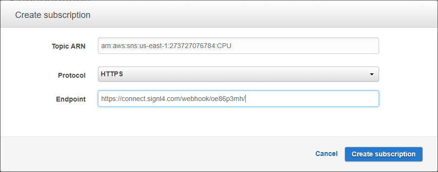
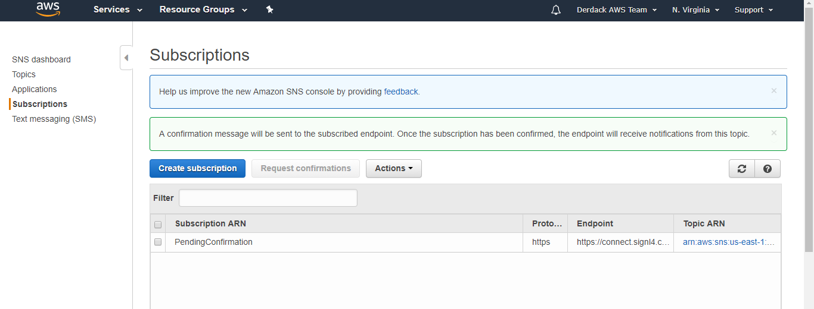
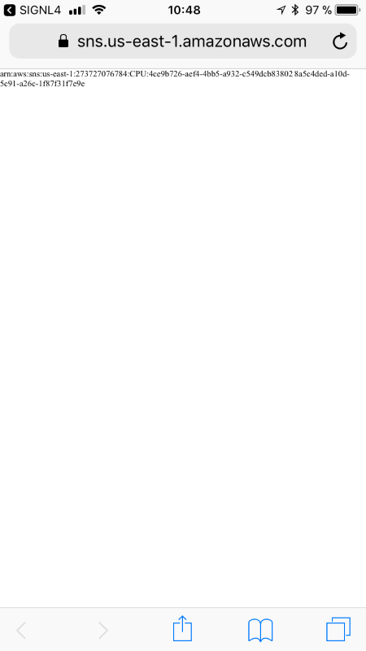
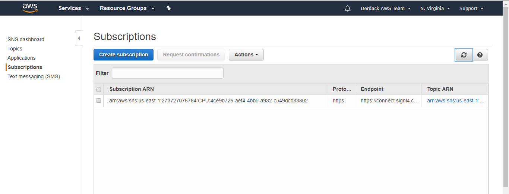

# SIGNL4 Integration with AWS CloudWatch

The combination of SIGNL4 and Amazon’s Simple Notification Service (SNS) enables AWS CloudWatch alarms to be sent out to your team’s mobile devices after-business hours.

### Adjust your Amazon SNS Settings to route AWS CloudWatch Alarms to SIGNL4

Monitoring alarms created by CloudWatch are notified by Amazons [Simple Notification Service (SNS)](https://console.aws.amazon.com/sns/). SNS is based on so called Topics and Subscriptions. Topics are targeted by monitoring alarms from CloudWatch. Subscriptions on Topics take care for sending notifications once the Topic got new content. It is most likely and assumed that you already have some Topics setup and that there is at least one Subscription that sends Topic contents to an AWS Lamda function which will post it to your Team’s Slack Channels.

The idea now is to send all your Topic contents to SIGNL4 in parallel. To do that, setup an additional Subscription in SNS which sends notifications directly to the webhook of your SIGNL4 team. The webhook is automatically provisioned for your team during sign up, thus it doesn’t need to be created manually as you may have done in Slack. Even better: unlike with your SNS/Slack integration, there is no need for an intermediate AWS Lambda function to get the data from SNS to SIGNL4.

The SIGNL4 webhook is intelligent and flexible enough to handle AWS SNS webhook calls directly. Follow the below steps to create the Subscription:

1. Log on to SNS and open your Subscriptions. It should list your AWS Lambda Sunscription(s) for Slack.
2. Click “Create Subscription”
    1. Enter the ARN of the Topic from which all contents should be sent to your team in after-hours
    2. Select HTTPS as protocol
    3. Enter the webhook of your SIGNL4 team in the endpoint field. You can find that URL e.g. in the SIGNL4 app under Settings (gear) -> Team -> APIs
    4. Click “Create subscription” to finish

]

]

Your new SIGNL4 Subscription is now in a pending status. AWS SNS has sent a confirmation message to your SIGNL4 webhook which you have to confirm in order to activate the subscription:

1. In the SIGNL4 mobile app you’ll find a new Signl from AWS
2. In the details of that Signl you’ll find a “Subscribeurl” that you simply need to open to activate the Subscription in SNS

After you have opened the Url in your mobile device browser, a refresh of your SNS subscriptions will now show an active status for your new SIGNL4 subscription:

You will now start seeing AWS CloudWatch alarms in your SIGNL4 team.

The alert in SIGNL4 might look like this.

