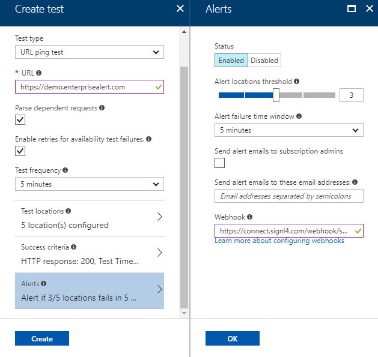

# SIGNL4 Integration with Azure Application Insights

Regardless of priority, all notification emails from Azure Application Insights have a tendency to look the same. Do not miss another important incident with on duty SIGNL4 mobile alerting and operations communication. Acknowledge incidents, take ownership, and communicate transparently all within SIGNL4.

## Are you using Azure Application Insights for health monitoring of your website or web app?

If so, I bet you have alerts setup to get notified in case of service health issues. By default, you or your whole team will get an email. But how do you know who took ownership. And in case of urgent issues, how do you ensure a timely response? Are you watching your mailbox around the clock?

Well, I have tried that, but it isn’t a lot of fun. The biggest problem is that all emails look the same. Identifying the one important email from Azure Application Insights among spam and low priority mails is very ineffective and close to impossible.  Another challenge is to make sure that alerts are targeted to people who are on duty. And to avoid following up on who is taking care when an issue war raised.  You simply don’t want to be firefighter around the clock. Transparency about response and resolution would be pretty awesome.

## SIGNL4 is the perfect mobile alert companion for Azure Application Insights

If you find yourself and your team reflected in this picture, SIGNL4 is your solution. SIGNL4 sends critical and relevant Application Insights alerts to your mobile phone via push. Only people who are on duty will receive those alerts. Alert notifications in SIGNL4 are persistent and require an active confirmation (simple tap in the app).  If an alert remains unconfirmed, operations staff on duty is paged again, and again until one of the team members does confirm the alert. And this acknowledgement is visible throughout the entire team in real-time along with any annotation users make. Push notifications can be configured to have a custom notification sound so they cannot be confused with WhatsApp or Facebook notifications. The visual display capabilities of SIGNL4 provide a much faster recognition and categorization of Azure Application Insights alerts.

## How to get started

In this example we are going to use Azure Application Insights for website monitoring.

To get started download the [SIGNL4 app](https://www.signl4.com/free-trial-test/) and sign up to create your team. Invite other "fire fighters", i.e. your team peers, so that you don’t remain the only one.

Next, let’s set up Application Insights. We’ll create a simple availability test for your site. In case you have it setup already, skip unnecessary steps and proceed to step 3 directly.

1. Open Application Insights and click on Availability. Then choose ‘Add test’ on the displayed blade.
2. Configure the test to ping your site in an appropriate interval and fine tune test locations and success criteria.
3. The last part, the Alerts, is certainly the most important one and opens a dedicated blade on click.
    1. Make sure to enable alerts and fine tune the locations threshold
    2. Deselect sending of emails (optional) and enter your SIGNL4 webhook URL in the webhook box. You can find your SIGNL4 webhook URL in the mobile app under "Gear Settings" -> "Team" -> "APIs"  
        
    3. Click OK to save your availability test

Your website availability test is now configured and any alerts are sent to your SIGNL4 team. In case you need to notify multiple SIGNL4 teams, call the webhook of a workflow service such as Microsoft Flow, Zapier or ITTT first and take it from there.

## Explore alerting with SIGNL4

In SIGNL4 I have created a dedicated system category for my availability alerts (under ‘Gear Settings’ -> ‘Team’ -> ‘Services & Systems’). My category has a keyword to match it to my availability alerts from Application Insights. I chose the string "test name"-"azure ressource name" which is a good start. This results in my Application Insights alerts showing up in the SIGNL4 app with a red color and the globe icon.

In case my monitored site becomes unresponsive, Application Insights will fire an alert which is sent to the SIGNL4 team. Team members checked in for duty are notified and can confirm the alert (simple tap on the encircled question mark). I’ve actually tested this alert notification flow by simply manipulating the site’s DNS records.

## Metrics and smart detection

In this blog post I’ve setup SIGNL4 as notification channel for website availability monitoring with Azure Application Insights. However, availability tests are just one source for alerts  in Application Insights. You can setup the same alert flow for your Metric alerts and for Application Insights’ Smart Detection capabilities:

- **Availability tests**: Availability -> Add test
- **Smart Detection**: Smart Detection -> Settings -> Failure Anomalies
- **Metrics**: Alerts -> Add metric alert

For each of these alert types, simply add your team’s dedicated SIGNL4 webhook in the configuration details as per my example above. Metric alerts also tie in with Azure Monitor.

The alert in SIGNL4 might look like this.

