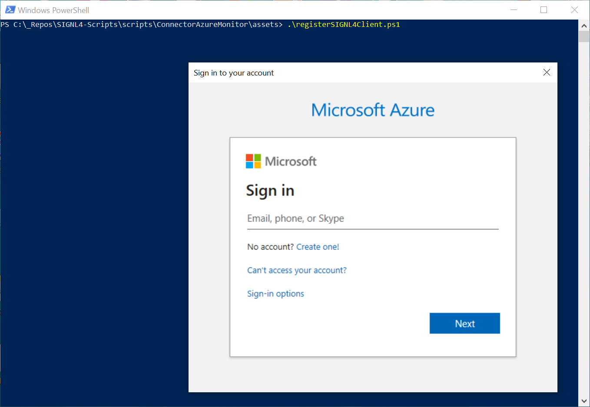
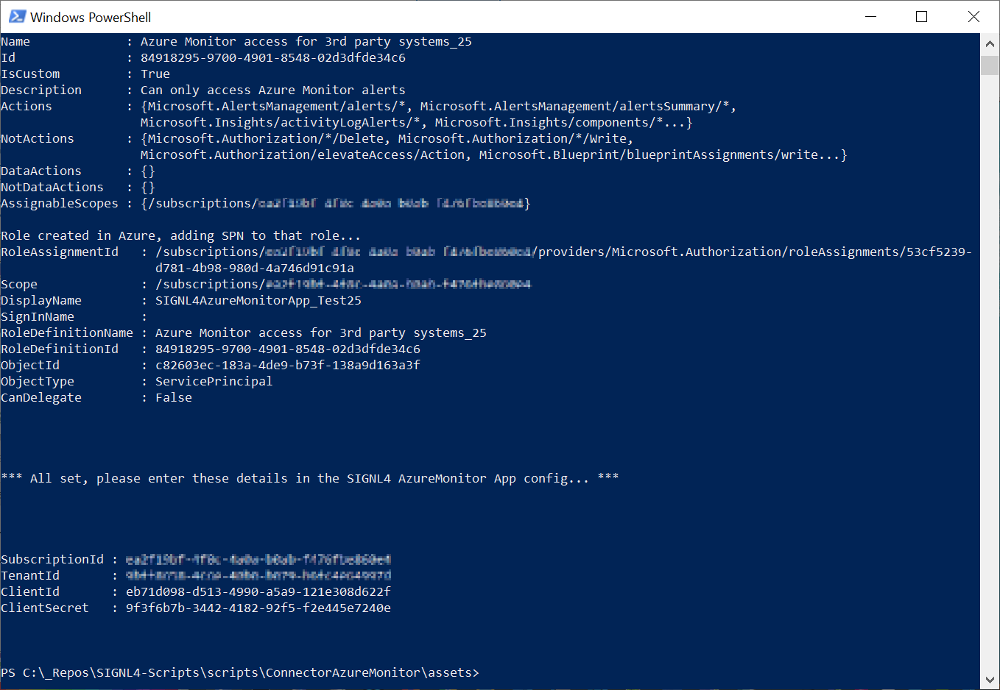
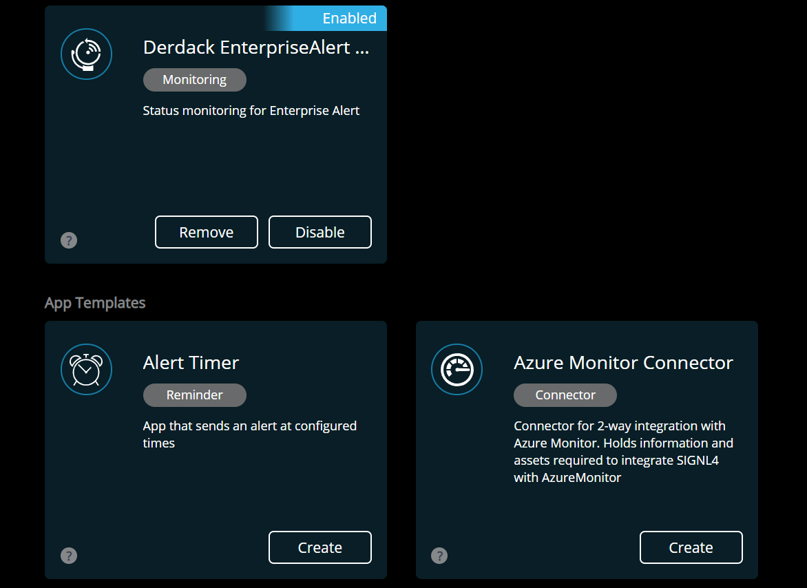
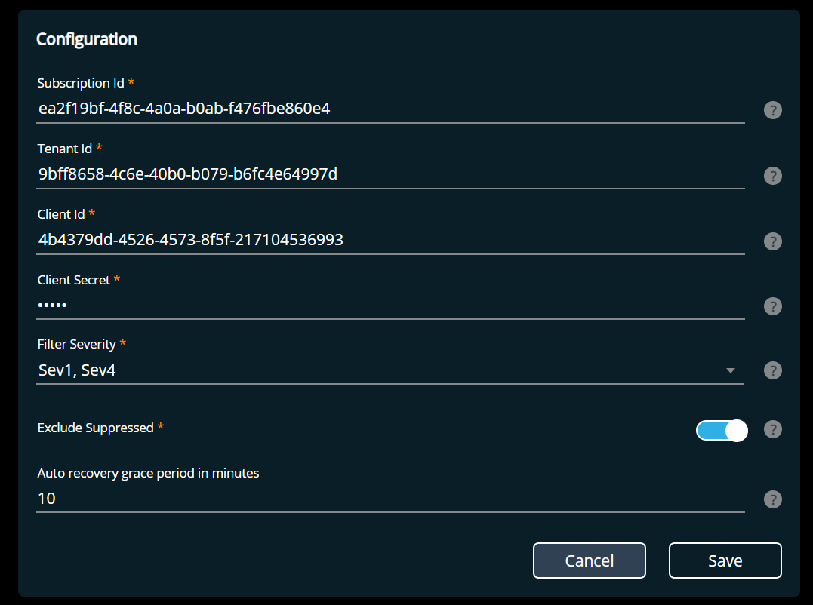

# SIGNL4 Integration with Azure Monitor

SIGNL4 adds powerful and reliable mobile alerting to Azure Monitor. As built-in alert notification capabilities of Azure Monitor are limited, SIGNL4 can increase reliability, convenience and manageability of important notification processes. SIGNL4 provides for duty scheduling and escalation procedures for an advanced alerting experience.

SIGNL4 integrates with Azure Monitor via an advanced 2-way connector allowing for remote alert management.

## How does the integration work?

SIGNL4 offers a simple, 2-way connector app that makes integration with Azure Monitor a child’s play. The connector app uses an Azure API to retrieve alerts from Azure and change their status, for example when an alert is acknowledged or closed in the SIGNL4 mobile app.  
In order for the connector app to access the alerts in Azure, it must first be created in Azure as a registered application. In order to be able to access Azure Monitor alerts only, it is also assigned a user role created specifically for it. Sounds too complicated? Not at all! The connector app includes a PowerShell script that automatically creates all these things in Azure for you.

## Let’s go – preparing Azure

The following assumes that you have downloaded the SIGNL4 app and have a SIGNL4 account. Furthermore you need [Azure Power Shell](https://docs.microsoft.com/en-us/powershell/azure/install-az-ps?view=azps-3.0.0).

1. Download [this PowerShell script](https://github.com/signl4/signl4-integration-azuremonitor/blob/master/registerSIGNL4Client.ps1). It registers a corporate application for SIGNL4 in Azure that has access only to your Azure Monitor alerts. Run the PS file. A window will appear where you need to log in to Azure. Then select the Azure subscription in which you want to create the enterprise application.  
    
2. The script outputs four IDs at the end. These IDs are needed in the next step, in which you add the Azure Monitor Connector app to your SIGNL4 team.
    - Subscription ID
    - Tenant ID
    - Client ID
    - Client Secret  
        

## Adding the Azure Monitor Connector App

After creating the possibility to access Azure Monitor from SIGNL4 in Azure, you can now add and configure the Azure Monitor Connector App in SIGNL4.

1. Log in to the [SIGNL4 web portal](https://account.signl4.com/manage) and click on Apps. At the top of this page you will see all apps of your SIGNL4 team, at the bottom you will see all app templates from which you can add new apps to your team.
2. In the App Templates area you will find the app named “Azure Monitor Connector”. A click on the tile opens the details on how the app works.  
    
3. Click on the button "Add". On the configuration page enter the following values:
    - **Subscription ID**: Your Azure Subscription ID (outputted by the PS script)
    - **Tenant ID**: Your Azure Tenant ID (outputted by the PS script)
    - **Client ID**: Client ID of the registered app for this connector app in Azure (outputted by the PS script)
    - **Client Secret**: Client secret of the registered app for this connector app in Azure (outputted by the PS script)
    - **Filter Severity**: Only alerts of the severities that are selected here will be retrieved by the connector app (outputted by the PS script)
    - **Include Suppressed**: When enabled, alerts suppressed by action rules are not retrieved by the connector app.
    - **Auto recovery grace period in minutes**: Delays alert notifications to the team for the number of minutes you enter here. Even better: if the monitoring condition is Resolved or the alert state is no longer New after that time (calculated based on alert fired timestamp), your team won’t be notified at all. Align this value with the amount of time you expect your auto-recovery actions or jobs to take but keep them shorter than 2 hours (max value here)! Otherwise your team will be notified immediately for each retrieved alert.  
        

## That’s it! Never miss an alert again and manage alerts on the go

The Connector app now continuously retrieves alerts from Azure Monitor and reliably notifies your team via push, SMS or phone calls – all on your terms and preferences.

When you acknowledge or close a Signl in the SIGNL4 mobile app, it updates the status of the corresponding alert in Azure Monitor. No more need to log on to the Azure console to acknowledge and close alerts there. You go the right tool in your pocket now.

Our have a look at your integration video:

<iframe data-cmplz-target="src" data-src-cmplz="https://player.vimeo.com/video/377799830?title=0&amp;byline=0&amp;portrait=0"  src="about:blank" width="560" height="315" frameborder="0" allowfullscreen="allowfullscreen" data-mce-fragment="1"></iframe>

The alert in SIGNL4 might look like this.

