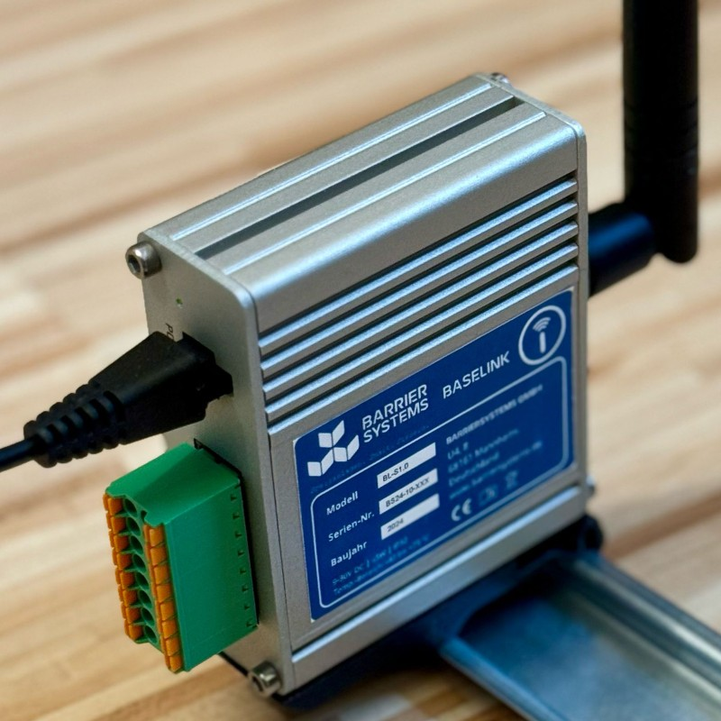
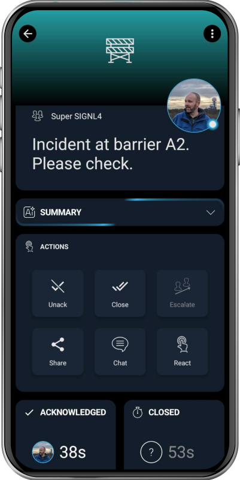

# SIGNL4 Integration with BarrierSystems

[BarrierSystems](https://www.barriersystems.de/en/index.html) offers a manufacturer-independent smart access management system that can retrofit existing barriers, gates, bollards, etc. to be controlled and monitored via a cloud-based platform. Their technology also incorporates AI-based vehicle detection and automatic authorization, enabling secure and situational access control for city centers and industrial sites.

SIGNL4 adds reliable mobile alerting to Obsidian with features like mobile app, push notifications, SMS messaging, voice calls, automated escalations, and on-call duty scheduling. SIGNL4 ensures that critical alerts reliably reach the responsible personnel – anytime, anywhere.



BarrierSystems also offers hardware devices that support dry contacts or Modbus TCP, enabling a wide range of applications across IoT, IIoT, and industrial production environments. With mobile connectivity, distributed field systems can function autonomously without reliance on LAN or Wi-Fi infrastructure.

## Prerequisites
A SIGNL4 (https://www.signl4.com) account
A BarrierSystems (https://www.barriersystems.de/en/index.html) hardware device

## How to Integrate

The integration of SIGNL4 with BarrierSystems is straightforward. The following describes two options.

BarrierSystems devices support running Python code, making integration straightforward. When an incident is detected – whether through a barrier, dry contact, or via Modbus TCP – the Python script can automatically trigger a SIGNL4 alert.

An example of Python code is shown below (please insert your own SIGNL4 team or integration secret):

```python
# Send SIGNL4 alert from Python

import requests

# Your SIGNL4 team or integration secret
teamSecret = 'your-signl4-or-integration-secret'

# SIGNL4 webhook URL
webhook_url = 'https://connect.signl4.com/webhook/' + teamSecret

# Alert data
alert_data = {
  'Title': 'Alert',
  'Message': 'SIGNL4 alert from Python'}

result = requests.post(url = webhook_url, json = alert_data)

if result.status_code == 201:
  # Success
  print(result.text)
else:
  # Error
  print('Error: ' + str(result.status_code))
```

If you are using the BarrierSystems Hub, you can also trigger alerts directly from there, for example via email.

The alert in SIGNL4 might look like this.



