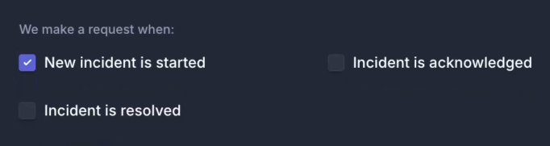
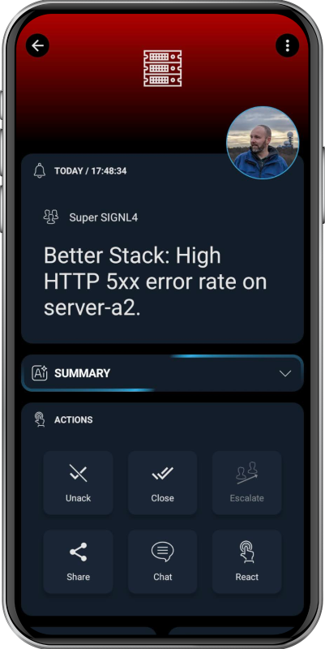

# SIGNL4 Integration with Better Stack

[Better Stack](https://betterstack.com/) is a modern monitoring and incident management platform that helps teams detect, resolve, and prevent downtime. It combines logging, metrics, uptime monitoring, and incident management into a single, easy-to-use solution. With real-time dashboards, structured logs, and alerting, Better Stack reduces response times and improves reliability.

SIGNL4 adds reliable mobile alerting to Better Stack with features like mobile app, push notifications, SMS messaging, voice calls, automated escalations, and on-call duty scheduling. SIGNL4 ensures that critical alerts reliably reach the responsible personnel – anytime, anywhere.

## Prerequisites
- A SIGNL4 (https://www.signl4.com) account
- A Better Stack (https://betterstack.com/) account

## How to Integrate

The integration of SIGNL4 with Better Stack is straightforward and done by using the Webhooks. This is how it works.

1. In Better Steck go to Integrations -> Exporting data -> Outgoing webhooks.  
2. Click Configure button.  
3. Choose a type of webhook, usually Incident or Monitor.
4. Enter your SIGNL4 webhook URL.
5. The HTTP method is POST.
6. You can adapt the HTTP body template according to your needs.

That's it.

### Closing Alerts

the above will trigger a SIGNL4 alert. It is also possible to close the SIGNL4 alert if the incident is resolved in Better Stack.

In order to do so you need to use some special SIGNL4 parameters in the JSON payload.

Trigger the alert for "New incident is started".



Use this JSON payload.

```
{
  "Title": "$NAME",
  "Cause": "$CAUSE",
  "URL": "$URL",
  "X-S4-ExternalID":"$INCIDENT_ID",
  "X-S4-Status": "new"
}
```

You can add additional Better Stack placeholders of course, just leave the X-S4- parameters is listed.

Use this JSON payload to close the alert for "Incident is resolved".

```
{
  "X-S4-ExternalID":"$INCIDENT_ID",
  "X-S4-Status": "resolved"
}
```

The alert in SIGNL4 might look like this.


