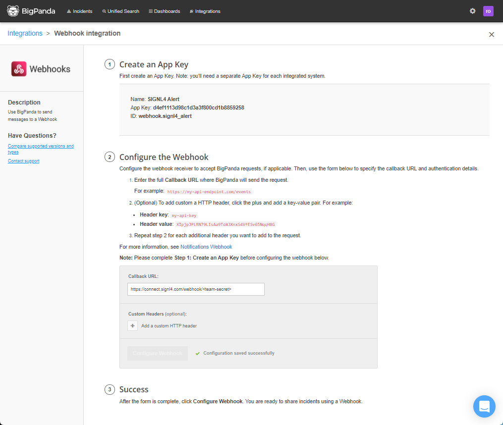
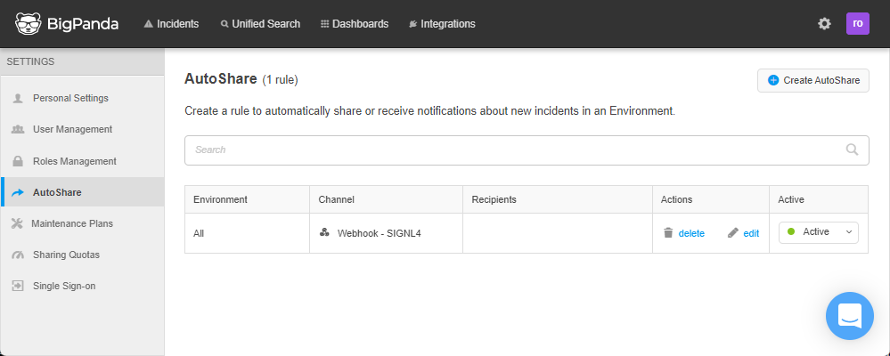

# SIGNL4 Integration with BigPanda

[BigPanda](https://www.bigpanda.io/) is an artificial intelligence software that detects and analyzes problems in IT systems. It provides capabilities for event correlation, root cause analysis, event enrichment and more.

SIGNL4 is available as webhook integration in BigPanda. This allows incidents to be forwarded to SIGNL4 via AutoShare.

# Webhook Integration

First you need to create the webhook integration with SIGNL4.

- In your BigPanda web portal go to “Integrations” -> “New Integration”
- Then, go to “Webhooks” and click “Integrate”
- Here, create an “App Key”, enter a name and than click “Generate API Key”
- Configure the webhook and enter your SIGNL4 webhook URL including the team secret
- Click “Configure Webhook” and that is it

## Configure AutoShare

Now you can configure AutoShare to forward events to your SIGNL4 team.

- Go to “Settings” -> “AutoShare -> “Create AutoShare”
- Choose your “Environment”
- Then, select the SIGNL4 webhook you have created in the previous step under “Escalate via”
- Click “Next”
- Enter a personal message as additional information (optional)
- Click “Create” and that is it

Now PigPanda will notify your SIGNL4 team when critical incidents occur.

The alert in SIGNL4 might look like this.

