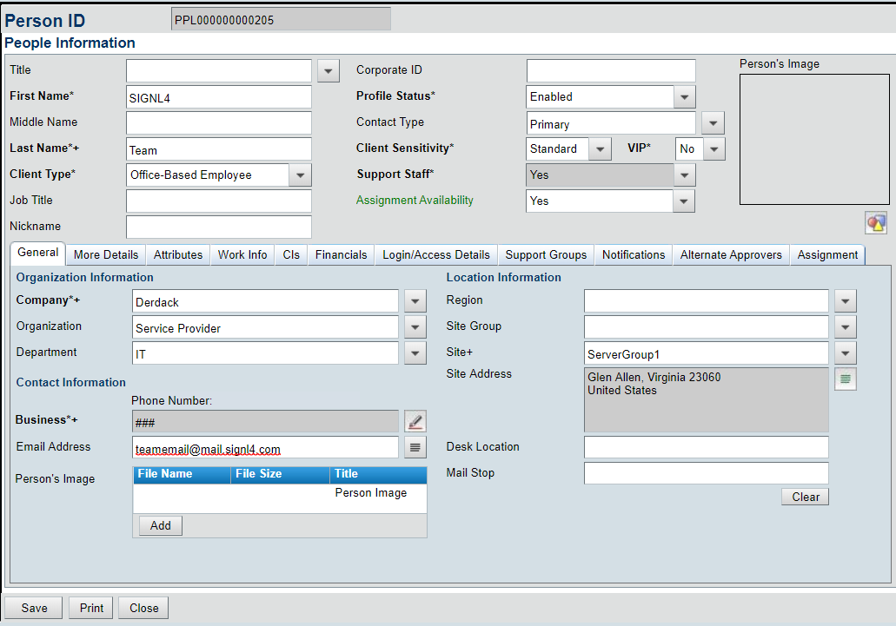
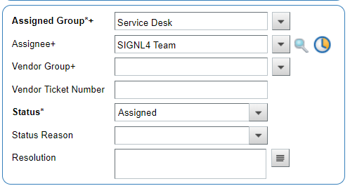
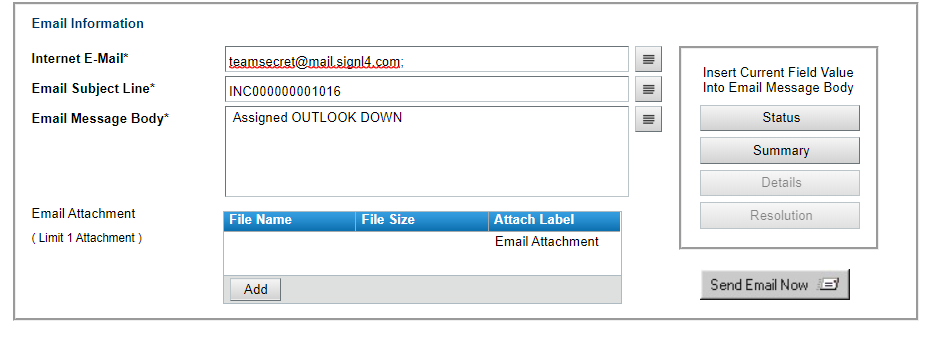
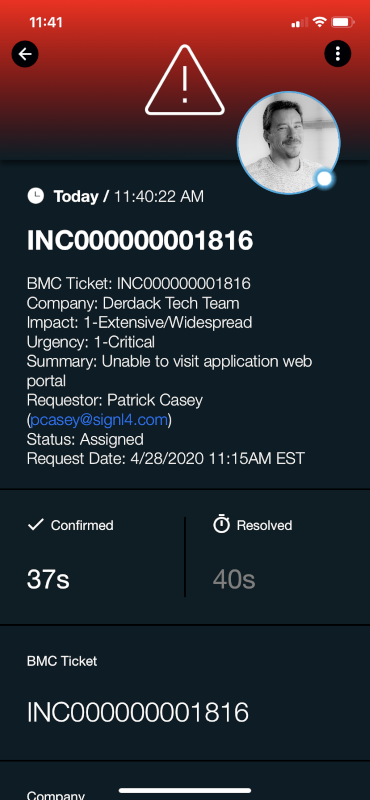

# SIGNL4 Integration with BMC Helix ITSM

This document will provide the reader with information on how to integrate the SIGNL4 with the digital service management platform BMC Helix ITSM (formerly BMC Remedy). After consulting this document, the reader should have a clear understanding of how Helix and SIGNL4 will interact with each other.

In our example we are going to be assigning a ticket to a user with the SIGNL4 team email address.

First, you will need to create a SIGNL4 user.  This user’s email address should be the team specific email provided when creating the SIGNL4 account.

Then assign tickets to this user to generate an email to the team.  On-call duty members will receive Push, SMS and Voice calls alerting them of the ticket creation.  Users can acknowledge and close the alert within SIGNL4 but will need to also do the same in Helix.

Additionally, you can escalate tickets to the SIGNL4 team by using the Email System Option. When viewing an open ticket, click on Email System and create an ad-hoc message to be sent to the on-duty SIGNL4 members.  This can also be done from the assignee’s inbox. For instance, if the assignee of the ticket needs to alert the SIGNL4 team of the ticket details, they can simply forward the email they received to the team specific email address.

On-duty team members will be alerted via Push, SMS and Voice calls of the new ticket assignment.

The alert in SIGNL4 might look like this.

