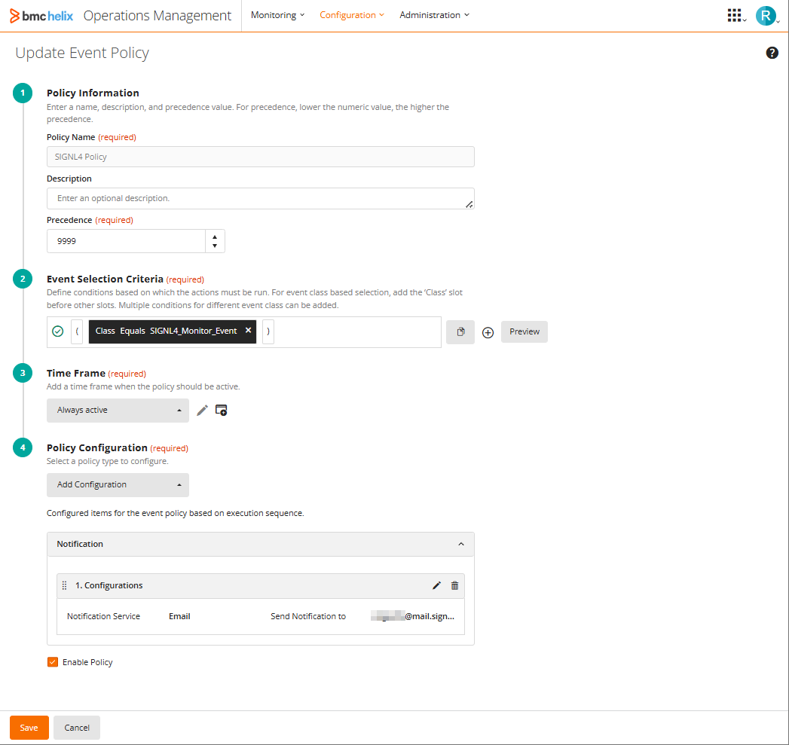
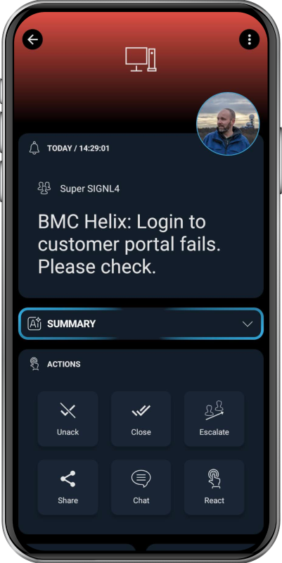

# SIGNL4 Integration with BMC Helix Operations Management

[BMC Helix Operations Management](https://www.bmc.com/it-solutions/bmc-helix-operations-management.html) is an AI-driven, cloud-native platform that provides intelligent monitoring, event management, and service automation to proactively detect, analyze, and resolve IT issues across hybrid and multi-cloud environments.


SIGNL4 operates at the alerting layer, complementing BMC Helix Operations Management. While BMC Helix can send emails to designated recipients when a new event is raised, SIGNL4 takes this a step further by transforming those emails into actionable alerts delivered to the right people at the right time. With features like mobile app push notifications, SMS messaging, automated escalations, and on-call duty scheduling, SIGNL4 ensures that critical alerts reliably reach the responsible personnel – anytime, anywhere.

## Prerequisites
A SIGNL4 (https://www.signl4.com) account
A BMC Helix Operations Manager (https://www.bmc.com/it-solutions/bmc-helix-operations-management.html) instance

## How to Integrate

The easiest was to integrate SIGNL4 with BMC Helix Operations Management is via email.

In order to configure email notifications for new events go to Configuration -> Event Policies in the web portal of BMC Helix Operations Management.

Here you create a new Event Policy with the event criteria that should trigger a new SIGNL4 alert, e.g. "( class equals 'SIGNL4_Monitor_Event' )" if this is the relevant event class.



Under Policy Configuration you add a new Notification and use Email as Notification Service. Enter your SIGNL4 email address as a subject and a message text.

The subject and message can contain placeholders for event parameters starting with '%'. The message text might look like this:

```
Message: %msg%
Priority: %priority%
X-S4-ExternalID: %_identifier%
X-S4-Status: new
```

You can add or modify the parameter here to meet your needs but be careful with the X-S4 parameters that are reserved by SIGNL4.

In order to close a SIGNL4 alert if an event gets closed in BMC Helix Operations Management you can create a second event policy similar to the first one.

In the email notification you choose: Event Status = Closed

And, the message text should look like this:

```
Priority: %priority%
X-S4-Status: resolved
```

Besides email you can also integrate using HTTP requests but as the time of the writing you need an additional on-prem instance of BMC Helix Operations Management for this.

## Two-Way Status Updates

It is also possible to send status updates from SIGNL4 back to BMC Helix Operations Management, e.g. when an alert in SIGNL4 has been acknowledged, annotated or closed. For this to work you need to configure the back-channel connector app for BMC Helix Operations Management in SIGNL4. In the SIGNL4 web portal go to Integrations -> Gallery and look for the BMC Helix Operations Management (<-) connector. Please note that the arrow points to the left. Here you configure your API URL, username and password. The other parameters are optional. You can find more information about the parameters by hovering over the (?) symbol. When ready, click Install and now status changes in SIGNL4 will reflect in the BMC Helix Operations Management event.

The alert in SIGNL4 might look like this.


