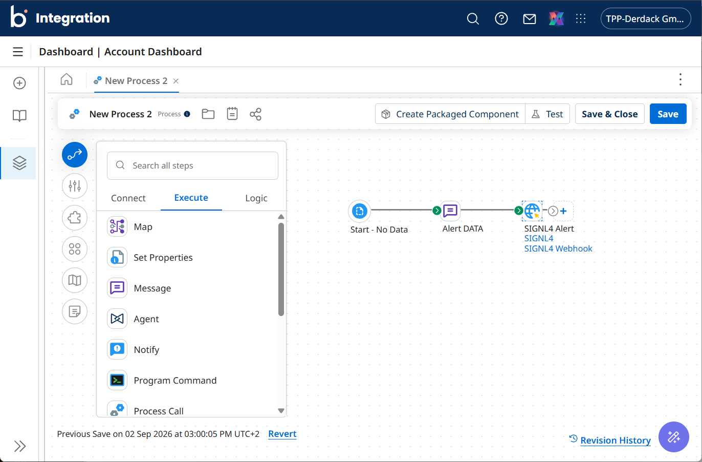
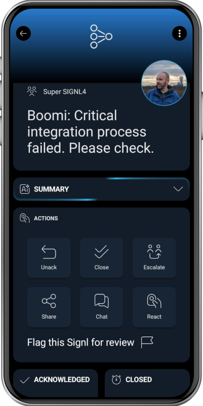

# SIGNL4 Integration with Boomi

[Boomi](https://boomi.com/) is a cloud-based integration and automation platform that connects applications, data, APIs, and systems across cloud and on-premises environments. Its low-code tools help organizations automate workflows, synchronize data, manage APIs, and integrate business applications without extensive custom development.

SIGNL4 extends Boomi with reliable mobile alerting, including a mobile app, push notifications, SMS messages, voice calls, automated escalations, and on-call scheduling. SIGNL4 ensures that critical alerts reach the right people reliably – anytime, anywhere.

Some common use cases include:
- Alert IT teams about critical Boomi errors and failures
- Notify on-call staff when integrations or workflows fail
- Escalate issues with delayed or failed data synchronization
- Alert teams about important business process exceptions
- Notify responders about API or service disruptions

## Prerequisites
- A SIGNL4 (https://www.signl4.com/) account
- A Boomi (https://boomi.com/) account

## How to Integrate

Integrating SIGNL4 with Boomi devices is straightforward.

## Option 1: HTTP Client



To send SIGNL4 alerts from a Boomi process, add an **HTTP Client** to your flow.

Configure the HTTP Client connection with your SIGNL4 webhook URL:

`https://connect.signl4.com/webhook/YOUR_TEAM_SECRET`

Replace `YOUR_TEAM_SECRET` with your SIGNL4 team or integration secret.

Set the **Action** to **Send** and configure the operation as an **HTTP POST** request with the content type `application/json`.

You can then pass JSON data to the HTTP Client to trigger an alert. For example:

```text
'{
    "Title": "Boomi Alert",
    "Message": "Hello world.",
    "X-S4-ExternalID": "some-id",
    "X-S4-Status": "new",
    "X-S4-SourceSystem": "Boomi"
}'
```

In a Boomi **Message** step, the surrounding single quotes prevent the JSON curly braces from being interpreted as Boomi parameters.

To resolve the same alert later, send another request using the same external ID:

```text
'{
    "X-S4-ExternalID": "some-id",
    "X-S4-Status": "resolved"
}'
```

You can replace the static values with dynamic Boomi parameters to include information from your process, application, or event data.

## Option 2: MCP

In Boomi Connect, add the [SIGNL4 MCP Connector](https://marketplace.boomi.com/solutions/mcp-connector-signl4) and configure it with a static SIGNL4 API key. Then make the connector available to your AI assistant or workflow. To trigger an alert, invoke SIGNL4 with a prompt such as “Send a critical alert to our on-call team about the database outage.” SIGNL4 then routes the alert to the appropriate on-call responders.

You can find more information on the [Boomi documentation page](https://help.boomi.com/docs/Atomsphere/Connect/MCPConnectors/signl4).

Now you can test your process and you should receive the SIGNL4 aler on your smartphpne.

That's it.

The alert in SIGNL4 might look like this.


