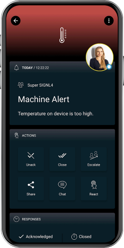

# SIGNL4 Integration with Building Management Systems

SIGNL4 provides standard interfaces for integration with building management systems.

In building management systems you can find various protocols and interfaces like C-Bus, Profibus, Profinet, DeviceNet, SOAP, XML, BACnet, LonWorks, Modbus, KNX, etc.

Please contact us at hello [@] signl4.com and we will be happy to help you find the best way to integrate with your systems.

The alert in SIGNL4 might look like this.

