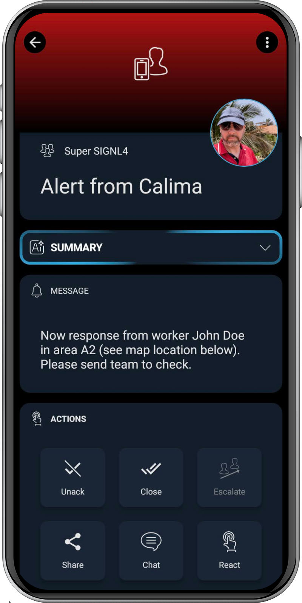

# SIGNL4 Integration with Calima

[Calima](https://en.calima.io/) offers a personal emergency signaling system that transforms employees' smartphones into safety devices, providing both manual and automatic alarm triggers to protect lone workers. The system includes a dead man's switch feature, which automatically detects immobility or falls and triggers an alarm to ensure rapid assistance.

SIGNL4 is a mobile alerting and incident management service for alerting responsible users or teams about critical situations as quickly and as reliably as possible. It supports app push, SMS test, voice calls, including escalation, shift planning and collaboration. Get the started at [https://www.signl4.com](https://www.signl4.com/).

SIGNL4 enhances Calima’s lone worker safety by instantly delivering mobile alerts triggered by Calima’s dead man switch, ensuring rapid response and team coordination in emergencies.

The integration of SIGNL4 with Calima is straightforward.

## Prerequisites
- A [SIGNL4](https://www.signl4.com/) account
- The [Calima](https://en.calima.io/) app

## How to Integrate

In the event of an emergency, Calima can send an email. You can configure this email to go to your SIGNL4 team email address. This will trigger a SIGNL4 alert and the response team can take according action. 

## SIGNL4 Alerting

The alert in SIGNL4 might look like this.

