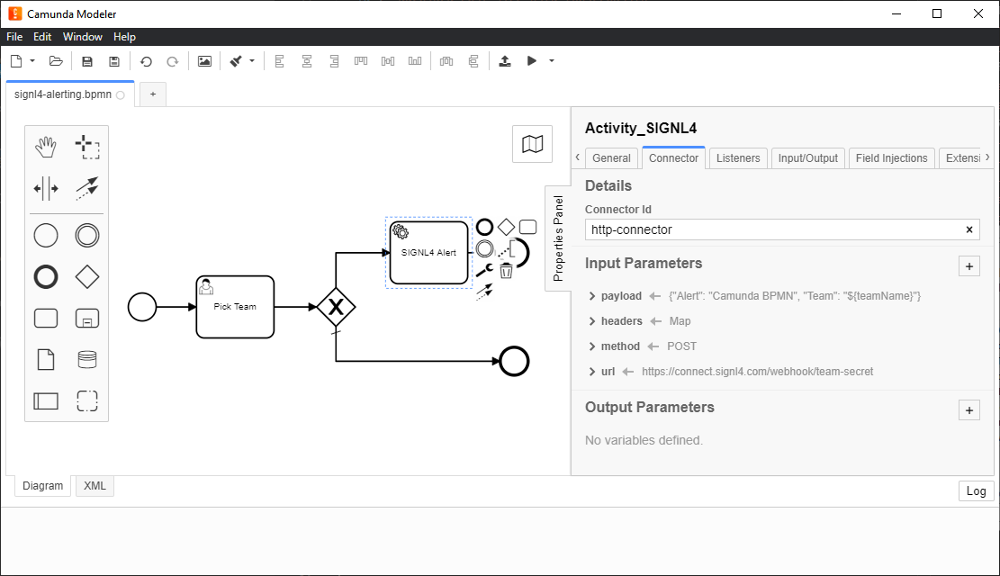

# SIGNL4 Integration with Camunda BPM

[Camunda BPM](https://camunda.com/) (Business Process Management) is an open-source workflow and decision automation platform. It provided tools for creating workflow and decision models, operating deployed models in production, and allowing users to execute workflow tasks assigned to them.

In the Camunda Modeler you can create a Service Task for SIGNL4 alerting whenever you need to send out an alert notification to your team.

The following steps describe how this works.

1. In your workflow you create a new Task of the type Service Task.
2. In this task create a Connector with the connector id "http-connector".
3. Assign the input parameters of this connector as follows:
    - url (String): Your SIGNL4 webhook URL including your team secret
    - method (String): POST
    - headers (Map): content-type: application/json
    - payload (String): JSON alert data, e.g. {"Alert": "Camunda BPMN", "Team": "${teamName}"}  
    You can use static text as well as dynamic values (with ${valueName}) in your payload field
4. This is it and now you can test your flow and you should receive the alert on your SIGNL4 app.

The alert in SIGNL4 might look like this.

