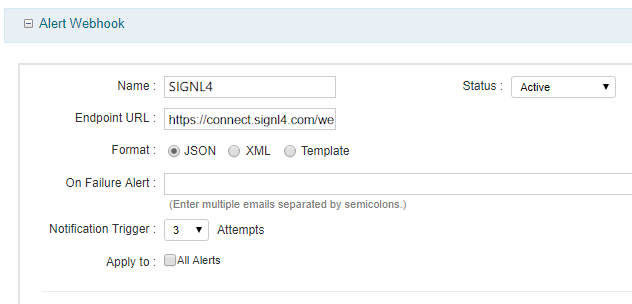
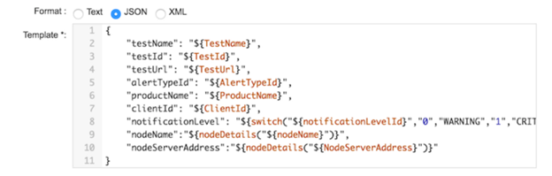
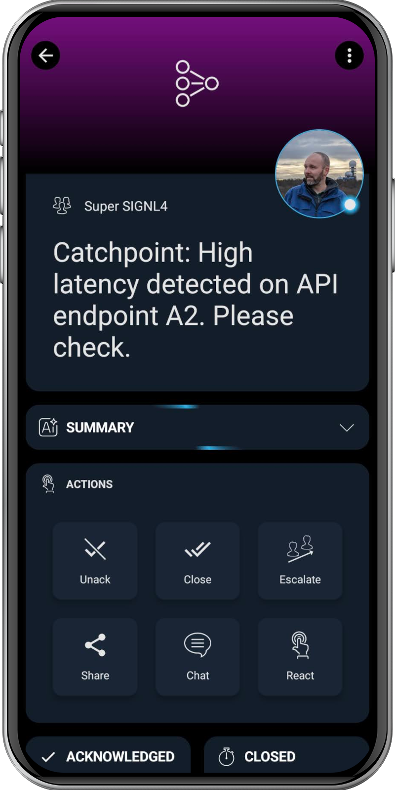

# SIGNL4 Integration with Catchpoint

[Catchpoint](https://www.catchpoint.com/) is a digital experience observability platform that enables organizations to monitor, analyze, and optimize the performance and availability of their applications, networks, and digital services. By providing real-time visibility into user experience and system health across the internet stack, Catchpoint helps ensure optimal reliability and performance for mission-critical systems.

[SIGNL4](https://www.signl4.com/) adds reliable mobile alerting to Catchpoint with features like mobile app notifications, SMS messaging, voice calls, automated escalations, and on-call duty scheduling. S/IGNL4 ensures that critical performance and outage alerts from Catchpoint immediately reach the right on-call engineers, enabling faster response and minimizing downtime – anytime, anywhere.

## Prerequisites

- A SIGNL4 (<https://www.signl4.com>) account
- A Catchpoint (<https://www.catchpoint.com/>) account

## How to Integrate

The integration of SIGNL4 with Catchpoint is implemented using a webhook.

1. Login to the Catchpoint Portal and go to **Settings** -> **API**.



2. Set the **Alert Webhook** status to **Enabled**, the **Status** to **Active**, and **Endpoint URL** to an existing SIGNL4 Inbound Webhook URL: <https://connect.signl4.com/webhook/{team-secret}>.
3. Select **Template** as Format then click **Add New**.
4. Select **JSON** as the format of the template.
5. Copy template file contents below:



```json
{
    "testName": "${TestName}",
    "testId": "${TestId}",
    "testUrl": "${TestUrl}",
    "alertTypeId": "${AlertTypeId}",
    "productName": "${ProductName}",
    "clientId": "${ClientId}",
    "notificationLevel": "${switch("${notificationLevelId}","0","WARNING","1","CRITICAL","3","OK")}",
    "nodeName":"${nodeDetails("${nodeName}")}",
    "nodeServerAddress":"${nodeDetails("${NodeServerAddress}")}"
} 

```

6. Save the template
7. You can set a backup email address to be notified of the alert in the case of the webhook failure.  This too can be delivered to a dedicated SIGNL4 email address: {teamsecret}@mail.signl4.com.
8. Save the API configuration.
9. Now when new alerts are raised, the alert details will be populated in the JSON template.  That payload is sent to SIGNL4 where alert notifications will be delivered to on-call personnel via mobile push, sms, voice call and emails.

The alert in SIGNL4 might look like this.



