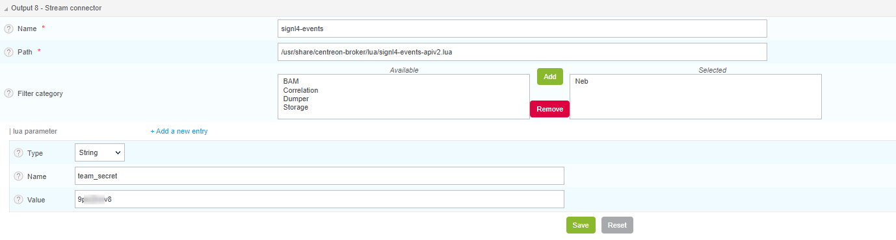
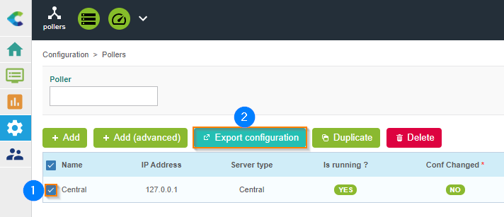

# SIGNL4 Integration with Centreon

[Centreon](https://www.centreon.com/en/) is a global provider of business-aware IT monitoring for always-on operations and performance excellence. Centreon is trusted by organizations of all sizes across a wide range of public and private sectors. Centreon is headquartered in Paris and Toronto, with sales offices in Geneva, Luxembourg and Toulouse.

SIGNL4 is available as a build-in notification channel. You can configure it directly in your Broker settings.

Go to "Configuration" -> "Pollers" -> "Broker configuration" menu and edit the "central-broker-master" configuration

Add a new "Generic – Stream Connector" output type.

Configure output parameters ("team_secret" is mandatory). This is your SIGNL4 team secret.

Export the configuration for your Central Server.

Enjoy and start managing Centreon alerts from your SIGNL4 mobile app.

Advanced instructions about how to configure the Centreon SIGNL4 connector are available [here](https://docs.centreon.com/current/en/integrations/event-management/sc-signl4-events.html).

The alert in SIGNL4 might look like this.

