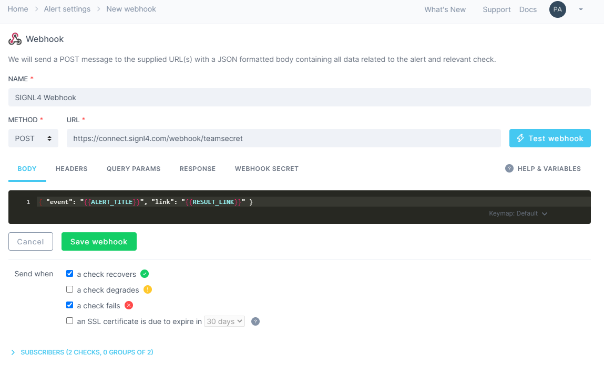
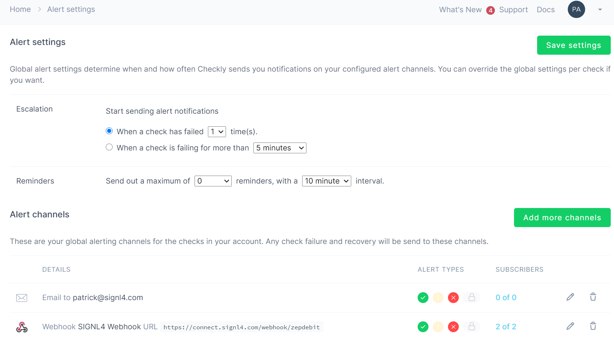
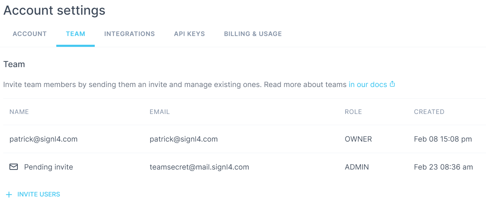

# SIGNL4 Integration with Checkly

[Checkly](https://www.checklyhq.com/) is an easy-to-use SaaS solution that checks for API and Synthetic monitoring. Checkly validates site transactions and alerts when there is a slowdown in production or an outage.

There are two ways for integrating SIGNL4 with Checkly. This is via HTTP request or via email.

## HTTP Request

Let’s customize a webhook integration within Checkly to make sure that we are sending an alerts that are raised to our SIGNL4 team. To configure alerting, click on the link labeled as such in the Tweak Your Alerting box from the Checkly Dashboard.



Click add channel for the Webhook section.

Enter the SIGNL4 webhook that is provided with your SIGNL4 account

Testing the webhook will immediately send an alert to SIGNL4 and team members will be notified via push, SMS and voice calls.

Resolve Alerts: In order to support the resolution of alerts in SIGNL4 you can just add the following part to your SIGNL4 webhook URL:

```
?ExtIDParam=sensorid&ExtStatusParam=laststatus&ResolvedStatus=Up
```

So, the complete URL looks like this:

```
https://connect.signl4.com/webhook/team-secret?ExtIDParam=sensorid&ExtStatusParam=laststatus&ResolvedStatus=Up
```

Where "team-secret" is your SIGNL4 team secret. You then need to add the parameters "sensorid" and "laststatus" to the Payload:

```
Title=%device: %name&Message=%message&sensorid=%sensorid&laststatus=%laststatus
```

You can find more information about the resolution of alerts in SIGNL4 here: [https://www.signl4.com/blog/update-july-2020-resolve-alerts/](https://www.signl4.com/blog/update-july-2020-resolve-alerts/). You can easily test the SIGNL4 notification template from here.



Then, at Devices -> Notification Trigger, you can specify your notification trigger including the conditions and the SIGNL4 notification template.

# Alternative Option: Email

Create a user within Checkly with the name of SIGNL4 and your team email address. Assign that user to a group that is monitoring existing sites.



At this point the next time something triggers an alarm, your S4 team will be notified via the mobile app.

The alert in SIGNL4 might look like this.


