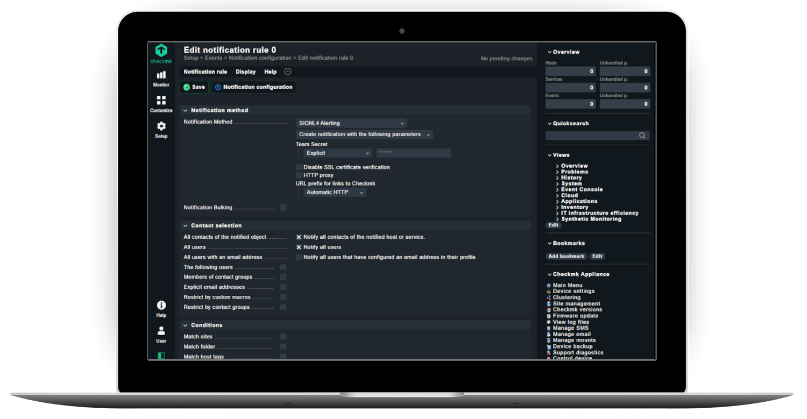
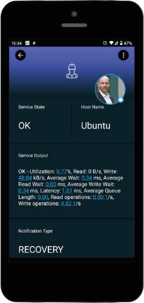

# SIGNL4 Integration with Checkmk

Mobile workers are not able to sit in front of a [Checkmk](https://checkmk.com/) dashboard and actively monitor problems. SIGNL4 enables Checkmk to notify the mobile teams in the field or on call in real-time. This speeds up their response significantly and frees resources in the operations.

**Checkmk 2.0 and higher**: In Checkmk version 2 and later SIGNL4 is available as a build-in notification channel. You can configure it directly in your notification settings. You just have to enter the SIGNL4 team secret here.

## Two-Way Integration

For two-way communication there is a Checkmk connector app available in SIGNL4 under Teams -> Apps -> Checkmk. This connector app adds two-way functionality to SIGNL4 alerting in Checkmk. It allows you to acknowledge, close or annotate Checkmk events directly from within your SIGNL4 app.

In order to use the Connector you need to make sure you have Checkmk 2.0 or higher installed and SIGNL4 alerting activated. The configuration of the Checkmk connector app is straightforward. You just need the Checkmk username, password and the public-facing URL to your Checkmk server. The user account needs to have the according access rights for the Checkmk REST API.

The following video shows how to integrate SIGNL4 with Checkmk 2.x:
<iframe width="560" height="315" src="https://www.youtube-nocookie.com/embed/4-HtakTR4SI?si=bxdbBf-40VLUF5Bi" title="YouTube video player" frameborder="0" allow="accelerometer; autoplay; clipboard-write; encrypted-media; gyroscope; picture-in-picture; web-share" referrerpolicy="strict-origin-when-cross-origin" allowfullscreen></iframe>

## Older Versions of Checkmk

For older versions of Checkmk Derdack provides a dedicated plugin for Checkmk here: [https://github.com/signl4/signl4-integration-checkmk](https://github.com/signl4/signl4-integration-checkmk)

You can also find the integration scripts on GitHub: [https://github.com/signl4/signl4-integration-checkmk](https://github.com/signl4/signl4-integration-checkmk). Just go ahead, download the respective plugin from there and follow the instructions on the page.

The alert in SIGNL4 might look like this.

