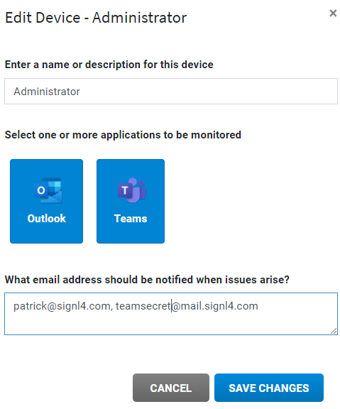

# SIGNL4 Integration with CloudFit

CloudFit is an easy to use hybrid solution that monitors your cloud environment.  Simply downloading an agent will have your cloud services and systems linked to the CloudFit command center where alerts are visualized.  Emails are sent when these services are unavailable.

In our example we are using CloudFit to monitor the health of Microsoft Teams.  We are forwarding the alarms raised in CloudFit to SIGNL4 via the team email address.

SIGNL4 is a mobile alert notification app for powerful alerting, alert management and mobile assignment of work items.  Get the app at [https://www.signl4.com](https://www.signl4.com/)

## Prerequisites

- A SIGNL4 ([https://www.signl4.com](https://www.signl4.com/)) account
- An CloudFit ([https://www.cloudfitsoftware.com/](https://www.cloudfitsoftware.com/)) account

We are going to assume that you already have CloudFit running in your environment with linked devices and administrator emails associated to those devices.

We want to make sure alarms are sent to the SIGNL4 team. To do this we need to simply add the email in the notification section for a device.  Clicking on the Pencil icon to the right of a device in the Devices tab will open an Edit form for that device.  Enter the SIGNL4 email here and Save Changes.

It is really that simple! The next time the alarm raises in CloudFit, SIGNL4 will receive the email and immediate alert any on-call duty members.

The alert in SIGNL4 might look like this.

