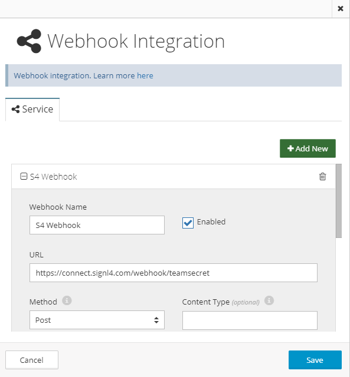

# SIGNL4 Integration with CloudMonix

[CloudMonix](https://cloudmonix.com/) from Netreo is a hybrid monitoring service capable of monitoring not only on-prem servers but also Azure and AWS installations. Performance monitors are easy to configure, and notification channels are configured with just a few clicks.

First we need to establish a connection to S4 using a webhook. Detailed steps to setup Webhook integration as follows:

Navigate to Integrations screen and create a new Webhook Integration.

Specify URL endpoint for target webhook.

Specify web method to use for this endpoint (POST).

Now, the last step is to tell CloudMonix what notifications and from what resources need to be published to this custom Webhook. Navigate to Notifications screen under Account Settings in CloudMonix and create a new notification rule that sends notifications from resources to your newly defined SIGNL4 Webhook.

The alert in SIGNL4 might look like this.

