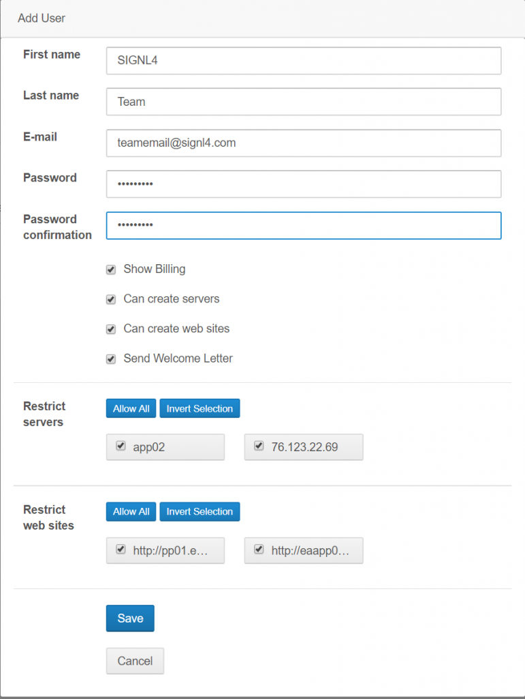
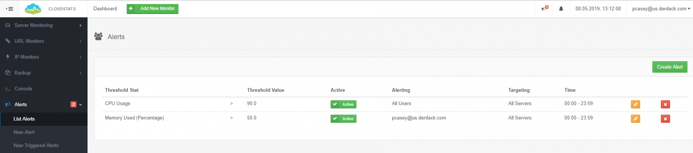
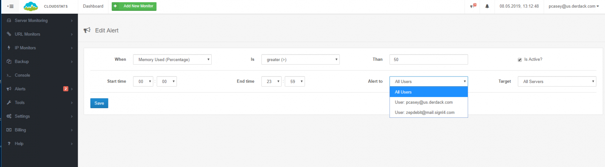

# SIGNL4 Integration with CloudStats

CloudStats is a free cloud-based monitoring tool which provides an easy to use web portal that shows server activity such as CPU, Disk, Memory and Network usage.  CloudStats can monitor IP addresses for ping availability as well as Website URL connectivity.

First you will need to create a user for your SIGNL4 team email address.  Click on Settings > Users to create a user.

Give the user the SIGNL4 team email address.  This will route all messages to that single address which will ring on each team members mobile device.

Next you will need to specify which alerts will go to this team.

The next time the alert is raised your SIGNL4 team will be alerted immediately.

