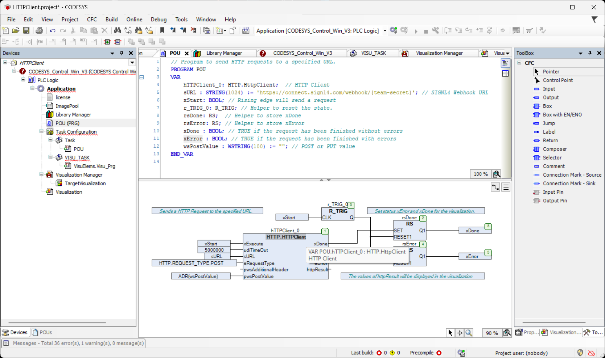

# SIGNL4 Integration with CODESYS

[CODESYS](https://www.codesys.com/) (Controller Development System) is a comprehensive software platform used for programming, configuring, and controlling industrial automation systems. It is particularly popular in the field of programmable logic controllers (PLCs). Originally developed by the German company 3S-Smart Software Solutions, CODESYS provides an integrated development environment (IDE) that supports multiple programming languages as defined by the IEC 61131-3 standard. It is widely used for factory automation, building management systems, motion control systems (e.g., robotics) or process control in sectors like energy and water management.

Integrating SIGNL4 with CODESYS can enhance your daily operations with an extension to your mobile team in the field or on the shop floor.

SIGNL4 is a mobile alert notification app for powerful alerting, alert management and for mobile assignment of work items. Get the app at [https://www.signl4.com](https://www.signl4.com/).

## Prerequisites
- A [SIGNL4](https://www.signl4.com/) account
- CODESYS (download at [https://www.codesys.com/](https://www.codesys.com/)

## How to Integrate

For triggering SIGNL4 alerts from CODESYS you need to send an HTTP Post request.

In our example we use the HTTP.HttpClient library and the example from [here](https://forge.codesys.com/prj/codesys-example/http-client-exa/home/Home/).



```pascal
// Program to send HTTP requests to a specified URL.
PROGRAM POU
VAR	
	hTTPClient_0: HTTP.HttpClient;	// HTTP Client
	sURL : STRING(1024) := 'https://connect.signl4.com/webhook/{team-secret}'; // SIGNL4 Webhook URL
	xStart: BOOL; // Rising edge will send a request
	r_TRIG_0: R_TRIG; // Helper to reset the state.
	rsDone: RS;  // Helper to store xDone
	rsError: RS; // Helper to store xError
	xDone : BOOL; // TRUE if the request has been finished without errors
	xError : BOOL; // TRUE if the request has been finished with errors
	wsPostValue : WSTRING(100) := ""; // POST or PUT value
END_VAR

```

The parameter sURL is your SIGNL4 webhook URL including team / integration secret.

You also need to make sure there the request is a POST request:
```
eRequestType := HTTP.REQUEST_TYPE.POST;
```

The parameter pwsPostValue is your alert content in JSON format, e.g.:
```json
{
    "Title": "Alert from CODESYS",
    "Message": "Test alert."
}
```

This will allow you to send HTTP Post requests and thus trigger SIGNL4 alert.

This [video](https://www.youtube.com/watch?v=Ibu4_FHtIHk) contains some helpful information about sending HTTP requests from CODESYS using the HTTP.HttpClient library. 

The alert in SIGNL4 might look like this.


