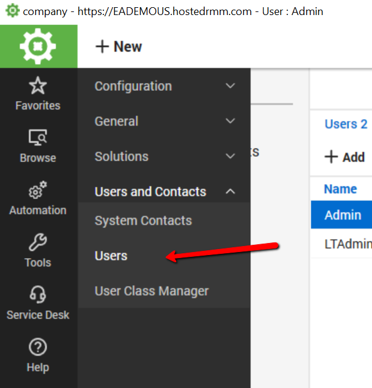
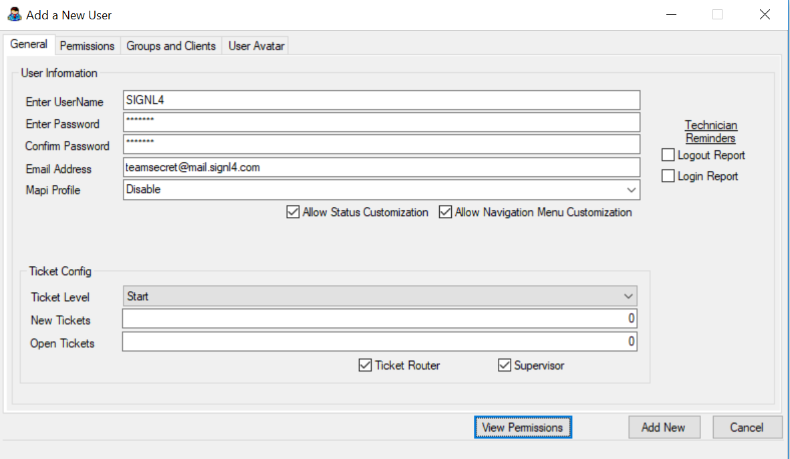
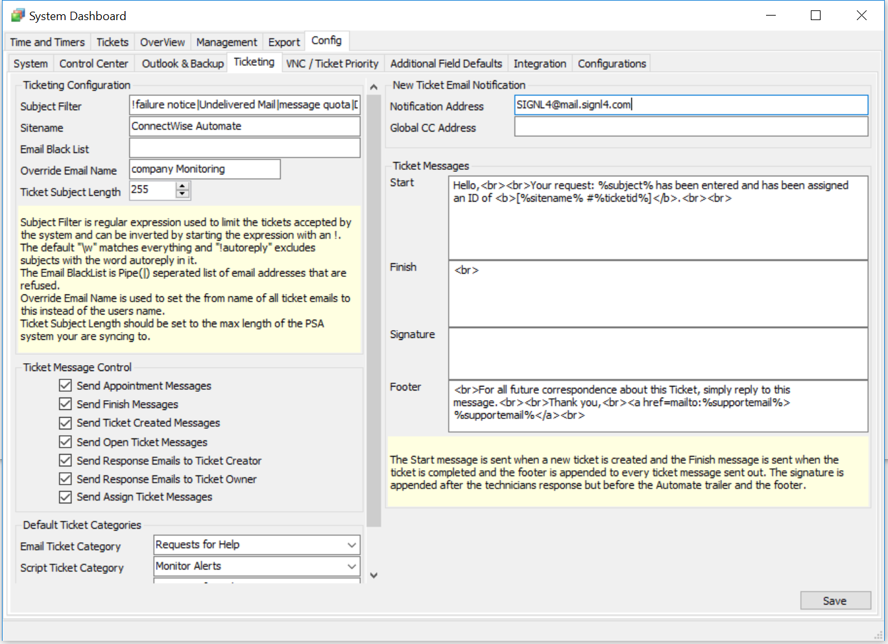

# SIGNL4 Integration with ConnectWise Automate

SIGNL4 can also integrate with ConnectWise Automate. This integration is based on email forwarding.

You just need to create a ConnectWise Automate user with the SIGNL4 team’s email address.  Each ticket that is assigned to that user will be forwarded to SIGNL4 and SIGNL4 triggers the configured notifications to the respective person on call.

For a more general approach you can set all new tickets that are opened to automatically be emailed to the SIGNL4 Team email.  This approach ensures that all newly created alerts and tickets will be delivered to members on-duty.

System -> Dashboard -> Config -> Ticketing

Please, note that the email forwarding option does not allow to update tickets in ConnectWise Automate upon acknowledgement or closure in the SIGNL4 mobile app. This feature is only available for ConnectWise Manage.

The alert in SIGNL4 might look like this.

