# SIGNL4 Integration with ConnectWise PSA

SIGNL4 integrates with ConnectWise PSA through an agentless 2-way connector app residing in SIGNL4. It requires little configuration in order to pull tickets and update them with status changes and annotations.

## Getting started with ConnectWise

SIGNL4 now includes a new app for connecting to ConnectWise Manage ("Manage"). This makes 2-way integration with Manage a breeze, and responding to service desk tickets can now be done conveniently via mobile app in SIGNL4. This blog article has all the important details.

### What features does the integration offer?

The integration offers the following features:

- New Signls, i.e. notifications via push, SMS or call for new service desk tickets
- Display of all desired ticket details, such as notes or tasks
- Status updates of service desk tickets via the mobile app
- Setting a ticket owner when acknowledged in SIGNL4
- Adding notes to tickets via the mobile app
- Synchronization of status changes in ConnectWise to SIGNL4.
- Ability to set which tickets should be transferred to SIGNL4 (e.g. only certain priority, etc.)

### How does the integration work?

The integration is based on the ConnectWise Manage REST API. SIGNL4 is a client application for this API and retrieves service tickets from it. API access uses credentials of an API member, which must first be created in Manage (see below). The member, its location, business unit/department, and default board define which service tickets can be seen/retrieved by SIGNL4. Generally, ConnectWise Manage on-premises or a cloud instance is supported. The Manage API version should be "2019.1" or newer.

### What components are needed in Manage?

The connector app in SIGNL4 requires several items in Manage. All except the API member are automatically created by the connector app when it is first started in SIGNL4. The following table gives an exact overview and explains further details about required prerequisites in Manage:

| Type          | Sample ID                  | Created by                          | Description                                                                                                                                                                                                                                                                                                                                                                                                                                                                                                                                                  |
|---------------|----------------------------|-------------------------------------|--------------------------------------------------------------------------------------------------------------------------------------------------------------------------------------------------------------------------------------------------------------------------------------------------------------------------------------------------------------------------------------------------------------------------------------------------------------------------------------------------------------------------------------------------------------|
| API Member    | signl4                     | ConnectWise Administrator           | Required for SIGNL4 to access the Manage REST API. Required properties/values: -&nbsp;&nbsp;&nbsp;&nbsp;&nbsp;&nbsp;&nbsp;&nbsp;&nbsp; Location -&nbsp;&nbsp;&nbsp;&nbsp;&nbsp;&nbsp;&nbsp;&nbsp;&nbsp; Business Unit -&nbsp;&nbsp;&nbsp;&nbsp;&nbsp;&nbsp;&nbsp;&nbsp;&nbsp; Default Board -&nbsp;&nbsp;&nbsp;&nbsp;&nbsp;&nbsp;&nbsp;&nbsp;&nbsp; Role: Admin -&nbsp;&nbsp;&nbsp;&nbsp;&nbsp;&nbsp;&nbsp;&nbsp;&nbsp; API Key Location, Business Unit and Default Board simultaneously define which service tickets can be retrieved by the connector app. |
| Custom Field  | Signl4Retrieved_c          | Connector App (automatically)       | Tracking on the service ticket if it must be retrieved or has been retrieved -&nbsp;&nbsp;&nbsp;&nbsp;&nbsp;&nbsp;&nbsp;&nbsp;&nbsp; Not visible in the UI &nbsp;                                                                                                                                                                                                                                                                                                                                                                                            |
| Custom Field  | Signl4Status_c             | Connector App (automatically)       | Required for automatic closing of Signls when corresponding service tickets change their status -&nbsp; &nbsp; &nbsp; &nbsp; Not visible in the UI                                                                                                                                                                                                                                                                                                                                                                                                           |
| Custom Field  | Signl4User_c               | Connector App (automatically)       | Required for assigning ticket owners -&nbsp; &nbsp; &nbsp; &nbsp; Not visible in the UI                                                                                                                                                                                                                                                                                                                                                                                                                                                                      |
| Workflow Rule | SIGNL4 - Trigger Signls    | &nbsp;Connector App (automatically) | Defines which service tickets are retrieved. By default, all new tickets with the status "New (not responded)" are retrieved. -&nbsp; &nbsp; &nbsp; &nbsp; Must contain 3 event triggers (more information on request) -&nbsp; &nbsp; &nbsp; &nbsp; Can remain inactive (Invocation via Manage REST API)                                                                                                                                                                                                                                                     |
| Workflow Rule | SIGNL4 - Update Signls     | Connector App (automatically)       | Defines when Signls should be acknowledged or closed automatically (e.g. when the status of a ticket changes to "Closed (resolved)") -&nbsp; &nbsp; &nbsp; &nbsp; Must contain 2 event triggers (more information on request) -&nbsp; &nbsp; &nbsp; &nbsp; Can remain inactive (Invocation via Manage REST API)                                                                                                                                                                                                                                              |
| Workflow Rule | SIGNL4 - Update CW Tickets | Connector App (automatically)       | Defines how service tickets should be updated when acknowledged or closed in SIGNL4. -&nbsp; &nbsp; &nbsp; &nbsp; Must contain 2 event triggers with corresponding actions (more information on request) -&nbsp; &nbsp; &nbsp; &nbsp; Can remain inactive (Invocation via Manage REST API)                                                                                                                                                                                                                                                                   |

## Set up integration ConnectWise

### Setup Step 1 - Create API Member in Manage

Follow these steps to create the API member in Manage:

1. Log in to ConnectWise Manage as an administrator
2. Click on "Members" in the menu under "System"
3. Now select the tab "API Members"  
    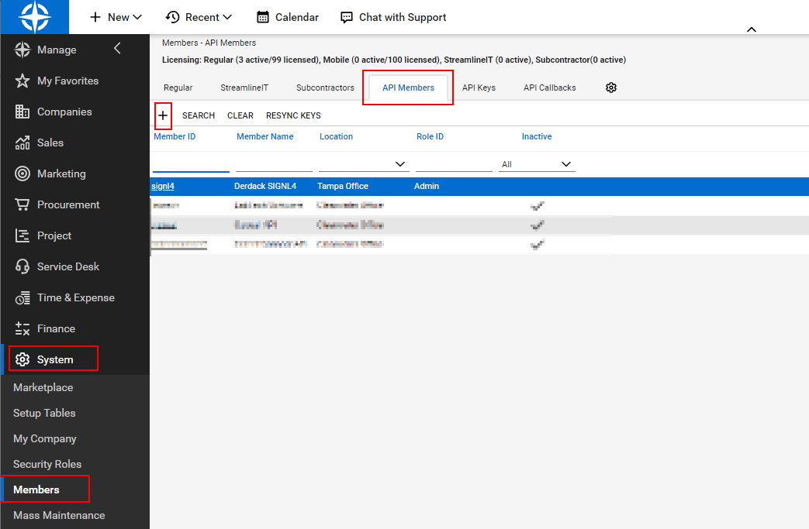
4. Click on "New Item" 
5. Now set the following properties, among others:
    
    1. Member ID (example: "signl4")
    2. Member Name (example: "Derdack SIGNL4")
    3. Role ID: Admin (You may create a custom role for SIGNL4 as mentioned below.)
    4. Location
    5. Business Unit
    
    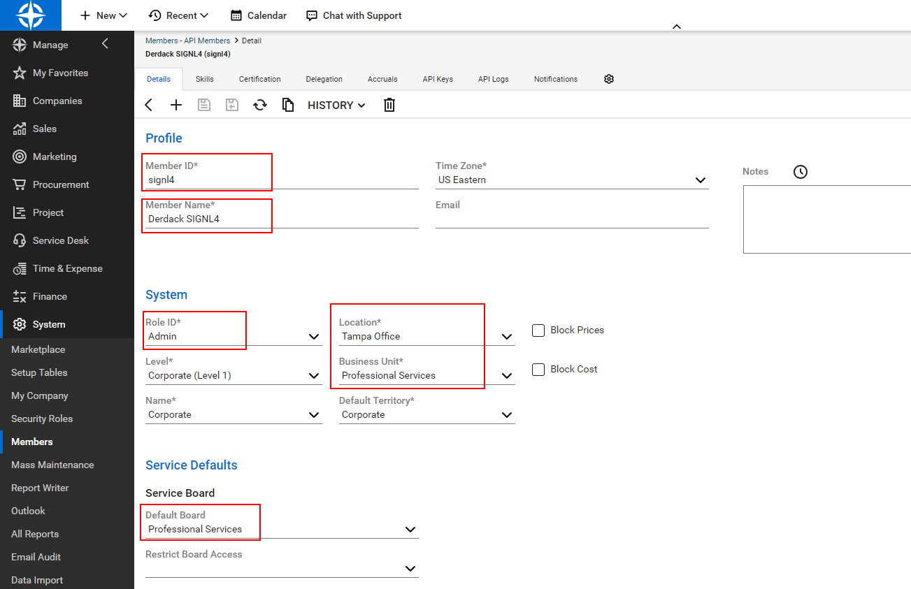
6. Save the member and open the "API Keys" tab.
7. Click on "New Item"
8. Enter a name (example: "SIGNL4") and save it.
9. Now copy the private key (it is no longer visible) and save it together with the public key, both will be needed in the next section.   
    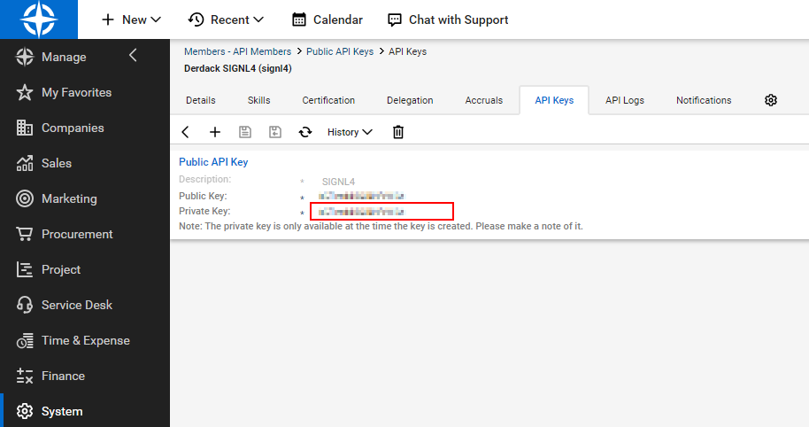

### Setup Step 2 - Configure connector app in SIGNL4

The following steps will now create the connector app in SIGNL4:

1. Log in to SIGNL4 as an administrator.
2. In the SIGNL4 web portal got to Integrations -> Gallery and select ConnectWise Manage.
3. At the bottom of the page, under App Templates, select ConnectWise Manage and click "Create". 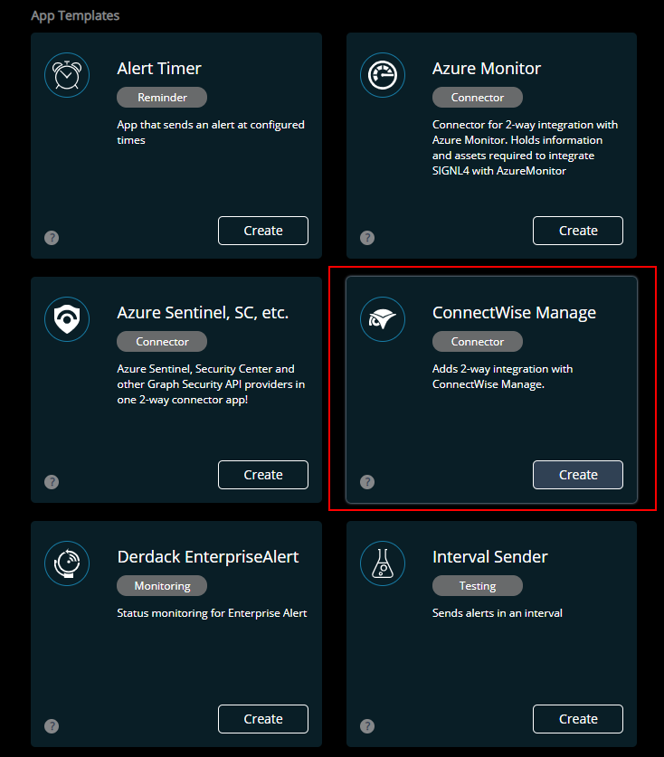
    1. **Instance URI**: The root URL of your ConnectWise Manage instance without any additional path. An example is https://na.myconnectwise.net
    2. **Company ID**: Your ConnectWise Manage company id.
    3. **API Member ID**: The ID of the API member you created earlier in setup step 1
    4. **Public API Key**: The public API key from the API key you created for the API member in Mange
    5. **Private API Key**: The private API key from the API key you created for the API member in Mange
    6. _Workflow Name - Triggering Signls_: Name of the workflow rule that will be used for the ticket transfer to SIGNL4 (see above). A workflow rule with this name will be created in Manage if it does not exist.
    7. _Workflow Name - Update Signls_: Name of the workflow rule used for automatic closing of Signls in SIGNL4 (see above). A workflow rule with this name will be created in Manage if it does not exist.
    8. _Workflow Name - Update CW Tickets_: Name of the workflow rule that defines how tickets are updated when Signls are acknowledged or closed in SIGNL4 (see above). A workflow rule with this name will be created in Manage if it does not exist.
    9. _Custom Field Retrieval_: Name of the custom field that controls the service ticket retrieval by SIGNL4 (see above). A custom field with this name will be created in Manage if it does not exist.
    10. _Custom Field Status_: Name of the custom field required for automatic closing of Signls in SIGNL4 (see above). A custom field with this name will be created in Manage if it does not exist.
    11. _Custom Field User_: Name of the custom field required for ticket owner mapping (see above). A custom field with this name will be created in Manage if it does not exist.
    12. **Owner assignment when**: Select here whether or when the user who acknowledges or closes in SIGNL4 is to be set as the ticket owner in Manage. The assignment is done via email address, i.e. the email of the user in SIGNL4 must be identical to the email address of the user in Manage ("Office email").
    13. **Status mappings**: Select which status updates should each be synchronized between both systems. The ticket status that should acknowledge or close a corresponding Signl in SIGNL4 can be selected on the triggers of the workflow 'SIGNL4 - Update Signls'. The ticket status to be set in CW when a corresponding Signl is acknowledged or closed in SIGNL4 is defined by the actions on the triggers of the workflow 'SIGNL4 - Update CW Tickets'.
    14. **Note options**: When a SIGNL4 user comments on a Signl, these comments are added as a note to the service ticket. Choose the flags you want these notes to be assigned (e.g. make sure it is added as an internal comment, not visible to the customer, etc.).
    15. **Additional details**: Select which details that may be linked to a service ticket should also be retrieved and added to the Signl.
4. Once all fields are configured, click on "Create".
5. On the details page that appears for the created app, click "Enable".
6. After that, the connector app will connect to ConnectWise and then create workflow rules and custom fields.  
      
Therefore, it may take some time until the app is activated. [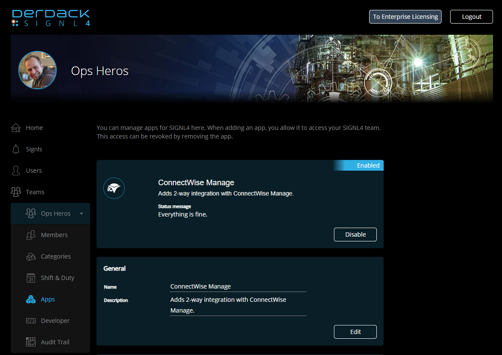

## ConnectWise: Creating a custom user role for the SIGNL4 API Member

In case you do not want to assign the “Admin” role to your SIGNL4 API member user account, you can follow these steps to create a custom role for that user. The custom role only activates a minimum set of permissions in CWM which are required by SIGNL4.

## Create a custom user role

Navigate to "System" -> "Security Roles" and click the "**+**" sign to add a new role.

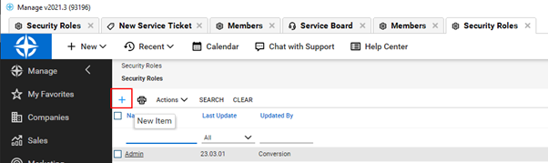

In the "Role ID" field, type "SIGNL4" and click the "Save" icon.

The Security Modules page will be displayed on which you need to activate the permissions as documented in the following sections.

## Permissions in module "Service Desk"

Activate the following permissions:

|Close Service Tickets|None|All|None|All|
|:----|:----|:----|:----|:----|
|Resource Scheduling|All|All|All|All|
|Service Ticket - Dependencies|None|All|All|All|
|Service Tickets|None|All|None|All|
|Ticket Templates|None|All|None|All|

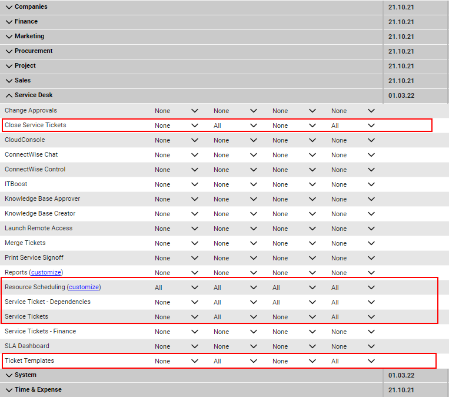

Please make sure to enable Resource Scheduling for all Locations or the Location that the API Member is assigned to work with. It is needed for Owner Assignments.

## Permissions in module "System"

Activate the following permissions:

|API Reports|None|None|None|All|
|:----|:----|:----|:----|:----|
|Member Maintenance|None|None|None|All|
|My Account|None|None|None|All|
|Table Setup (with customizations for Allow Access)|All|All|All|All|
|·&nbsp;&nbsp;&nbsp;&nbsp;&nbsp;&nbsp;&nbsp;&nbsp; General / Custom Fields| | | | |
|·&nbsp;&nbsp;&nbsp;&nbsp;&nbsp;&nbsp;&nbsp;&nbsp; General / Workflow_Rules| | | | |
|·&nbsp;&nbsp;&nbsp;&nbsp;&nbsp;&nbsp;&nbsp;&nbsp; Service / Service Board| | | | |

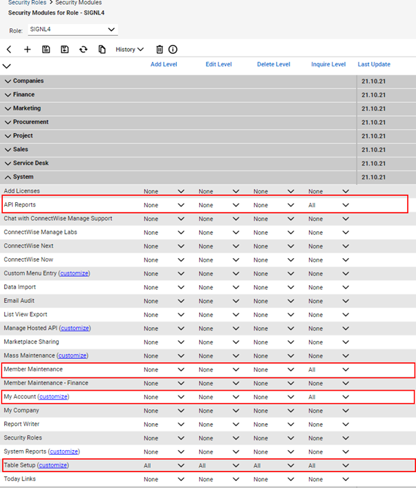

### Completion

Save your role and assign it to your API Member that you have created CWM earlier.

## ConnectWise: How can I specify which tickets are transferred?

First you need to understand that the ConnectWise Manage connector in SIGNL4 polls Manage for new tickets in a short interval (less than a minute). In other words, CWM does not push data to SIGNL4.

## How can you select what is polled and what not?

The answer is by using workflow rules. Yes, the connector sets up a workflow with some rules and if the rules match your tickets, they are retrieved from CWM. This magic happens via the CWM REST API which is the reason why you can leave all the workflows deactivated. We just use the available workflow triggers to build rules that tells SIGNL4 what is worth notifying.

## Modifying the Workflow Rule

Follow these steps to adjust the correct workflow:

1. Open Setup Tables -> General -> Workflow Rules
2. Find a workflow with the name "SIGNL4 - Trigger Signls" (or having the name you entered in the connector app config as "Workflow Name - Triggering Signls".
3. The Workflow has three event triggers, we only edit the first one or the one that has a rule that evaluates the custom field with the name "Signl4Retrieved_c" being false:  
    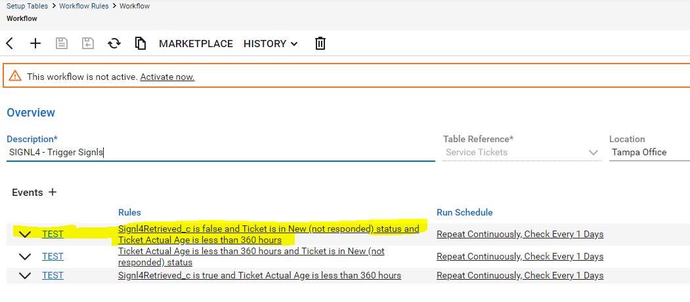
4. Click on the trigger rules to edit them in a new window  
    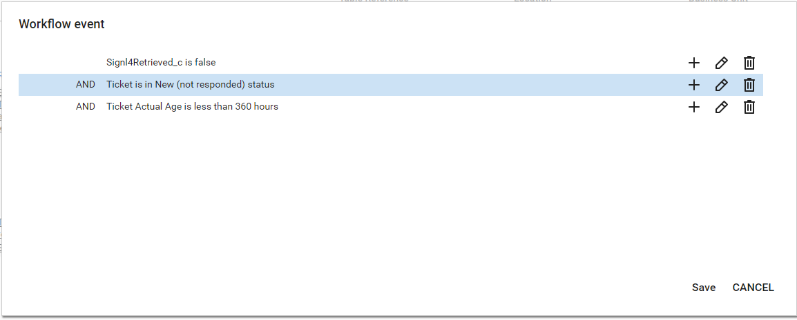
5. You may now substitute the rule that evaluates the ticket status with any group of rules of your choice. Important is that the rules for "Signl4Retrieved_c" and the ticket age remain as they are!  
    An example may look like this:  
    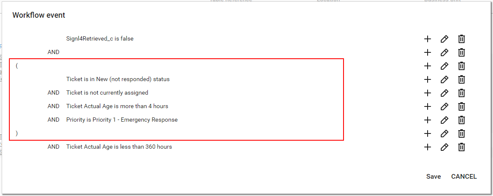

## Why does the workflow contain 2 more triggers?

The other two triggers are reserved for future use. They are of help when already polled tickets re-enter their initial status (meet the rules of the first trigger). In that case a Signl has already been created in SIGNL4 but you may want that to reopen or you want a new Signl. If that is the case please give us feedback and contact SIGNL4 support.

## Updating alerts in SIGNL4 when tickets change in ConnectWise

When a new ticket is created in ConnectWise Manage, SIGNL4 creates corresponding alerts (Signls). The Signl status can then be updated, when the corresponding ticket is changed inside ConnectWise Manage. Typical scenario is that during business hours you work in the CWM console directly and those activities should be synchronized and be up to date when you start your after hour duty in the SIGNL4 mobile app. 

## Configure status mapping in SIGNL4

First you have to make sure that the ConnectWise connector app in your SIGNL4 environment is configured correctly:

1. Log in to SIGNL4 and navigate to Apps
2. Locate your ConnectWise Manage connector app or create a new instance of that app first
3. Click Edit
4. Locate the property "**Status mappings**" at the bottom.  
    1. If you want an alert to get acknowledged, when the ticket is updated in CWM, make sure "Updated in CW -> Acknowledged in SIGNL4" is selected.
    2. If you (also) want an alert to get closed, when the ticket is updated in CWM, make sure "Updated in CW -> Closed in SIGNL4" is selected.
5. Your config may now look similar to this screenshot:  
    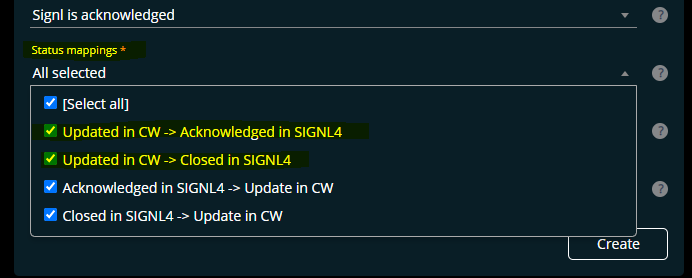
6. As a next step you can each select in ConnectWise Manage how a ticket must be updated to acknowledge or close the Signl.

### Select in ConnectWise when to acknowledge a SIGNL4 alert

Follow these steps to adjust the correct workflow:

1. Open Setup Tables -> General -> Workflow Rules
2. Find a workflow with the name "SIGNL4 - Update Signls" (or having the name you entered in the connector app config as "Workflow Name - Updating Signls".
3. The Workflow has two event triggers, you will edit the workflow rules of the trigger that has a rule which evaluates that the field "Signl4Status_c" does not contain the value "Acknowledged". Locate this trigger and click on the rules to edit them:  
    
4. Now replace the rule that evaluates the ticket status with any set of rules that a ticket must meet in order to acknowledge the alert in SIGNL4 which was created earlier for such a ticket:  
      
    An example looks like this: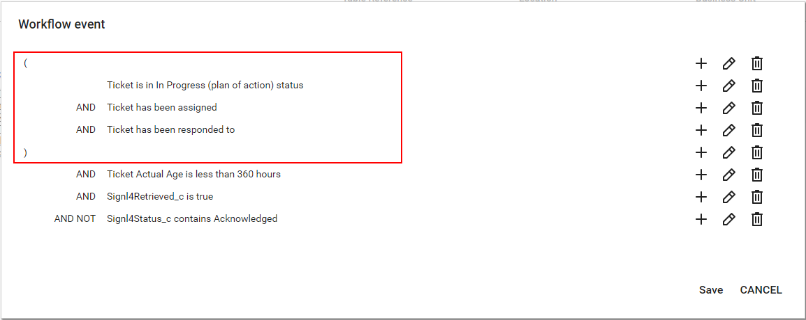
5. It is very important to leave all other three rules as they are!
6. Save the rules and you are done. Alerts are now acknowledged in SIGNL4 when the corresponding ticket meets your trigger rules.

### Select in ConnectWise when to close a SIGNL4 alert

1. Proceed in the exact same way as described above but edit the rules of the trigger that has a rule which evaluates that the field "Signl4Status_c" does not contain the value "Resolved".
2. In the trigger rules, replace the rule that evaluates the ticket status with any set of rules that a ticket must meet in order to close the alert in SIGNL4 which was created earlier for such a ticket.

## Updating tickets in ConnectWise when alerts are changed in SIGNL4

When users change alerts in SIGNL4 (acknowledge, close, etc.), corresponding tickets in ConnectWise can be updated as well. This happens by applying a set of workflow trigger actions to the corresponding ticket.

### Configure status mapping in SIGNL4

First you have to make sure that the ConnectWise connector app in your SIGNL4 environment is configured correctly:

1. Log in to SIGNL4 and navigate to Apps
2. Locate your ConnectWise Manage connector app or create a new instance of that app first
3. Click Edit
4. Locate the property "Status mappings" at the bottom.  
    1. If you want a ticket to be updated when the alert is acknowledged in SIGNL4, make sure "Acknowledged in SIGNL4 -> Update in CW" is selected.
    2. If you (also) want a ticket to be updated, when the alert is closed in SIGNL4, make sure "Closed in SIGNL4 -> Update in CW" is selected.
5. Your config may now look similar to this screenshot:  
    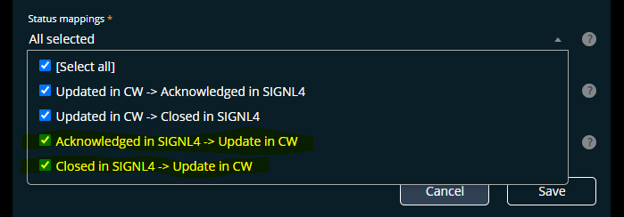
6. As a next step you can each select in ConnectWise Manage how a ticket is updated when the corresponding alert in SIGNL4 is acknowledged or closed.

## Select in ConnectWise how to update upon acknowledgement in SIGNL4

Follow these steps to adjust the correct workflow:

1. Open Setup Tables -> General -> Workflow Rules
2. Find a workflow with the name "SIGNL4 - Update CW Tickets" (or having the name you entered in the connector app config as "Workflow Name - Update CW Tickets".
3. The Workflow has two event triggers, each with one action. You will edit the workflow actions of the trigger that has a rule which evaluates that field "Signl4Status_c" equals "Acknowledged".
4. Locate this trigger and expand its actions:  
    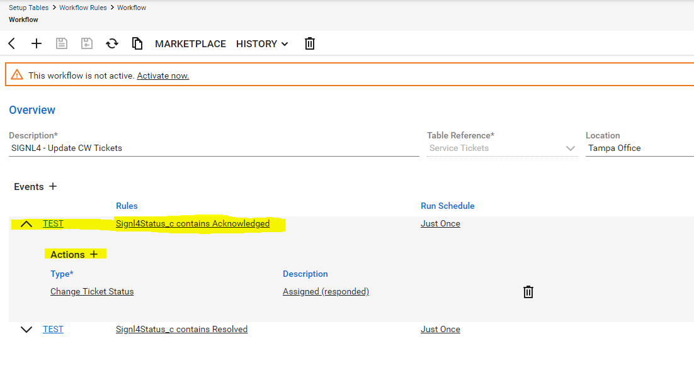
5. SIGNL4 applies all actions to the ticket, when the corresponding alert is acknowledged in SIGNL4 (e.g. in the mobile app). You can add more actions or simply change the status to set in this case. Here is an example:  
    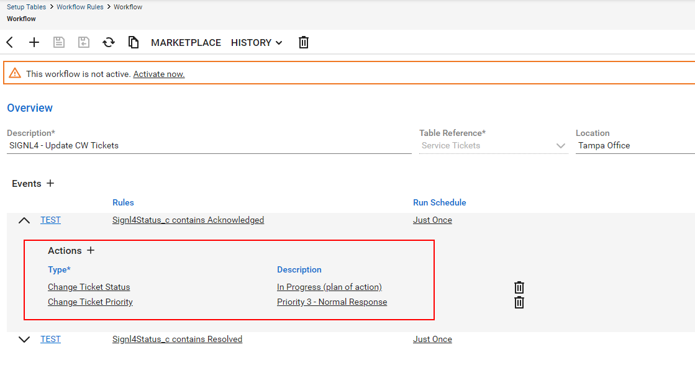
6. Make sure to save the workflow and you are done.

### Select in ConnectWise how to update upon closing in SIGNL4

To change how a ticket is updated when an alert is closed in SIGNL4, proceed in the exact same way as above. However, this time modify the actions of the event trigger that has a rule which evaluates field "Signl4Status_c" equals "Resolved".

The video provides a general overview of the integration of SIGNL4 with ConnectWise PSA.

<iframe width="337" height="189" src="https://www.youtube.com/embed/h_IIUcT0a4k" title="Tutorial: Setting up a Signl4 2-way connection to ConnectWise Manage" frameborder="0" allow="accelerometer; autoplay; clipboard-write; encrypted-media; gyroscope; picture-in-picture; web-share" referrerpolicy="strict-origin-when-cross-origin" allowfullscreen></iframe>

The alert in SIGNL4 might look like this.

