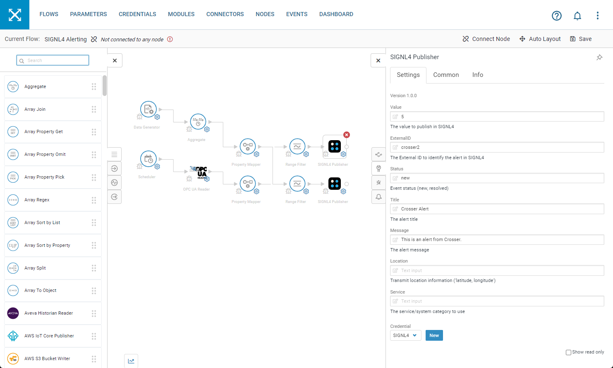
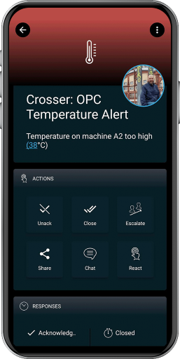

# SIGNL4 Integration with AVEVA CONNECT (formally Crosser)

[AVEVA CONNECT Flows](https://www.aveva.com/en/connect-experience/about-connect/flows/) formally [Crosser](https://crosser.io/) is a low-code platform for building real-time data pipelines across industrial OT, IT, edge, on-premises, and cloud systems. It connects, transforms, enriches, and analyzes operational data using prebuilt modules, connectors, automation, stream analytics, and AI.

In our example we create a sample flow that receives OPC UA data, processes them and then generates an alert in SIGNL4. SIGNL4 is a mobile alert notification app for powerful alerting, alert management and mobile assignment of work items. Get the app at [https://www.signl4.com](https://www.signl4.com/).

In order to show the concept in a simplified way we also use a data generator that is capable to generate sample data. This makes it easy to simulate alerts.

## Prerequisites

- A SIGNL4 (https://www.signl4.com/) account
- An AVEVA CONNECT (https://www.aveva.com/en/connect-experience/about-connect/flows/) account

## AVEVA CONNECT Flows

Logon to the AVEVA CONNECT portal and go to Flows. You can create or use your own flow as you like. In our case we have also added a Data Generator action. This one simulates random event data in certain intervals and is a good way for testing.

The next step in the flow is the aggregation. This is optional but since it is a powerful feature we show it here. The idea is to read events over a certain period of time and then aggregate the data. In our case we are interested in the average temperature.

The Range Filter allows us to trigger alert for a certain temperature range and close the alert again for another range.

Finally, add the SIGNL4 Publisher. In the Credentials you add your SIGNL4 team secret as API Key. Title and Message can contain the alert information.

To close an alert you have to use the same ExternalID with which the alarm was created and as status you enter “resolved”.

That’s it and now your SIGNL4 team will receive alerts whenever AVEVA CONNECT detects a critical event.

The alert in SIGNL4 might look like this.

