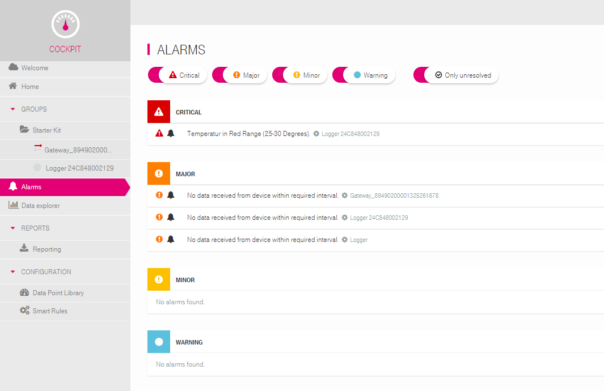
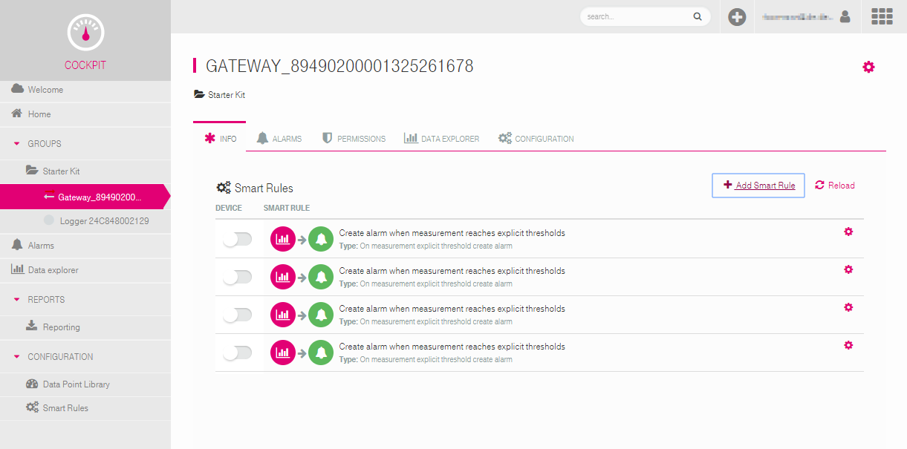
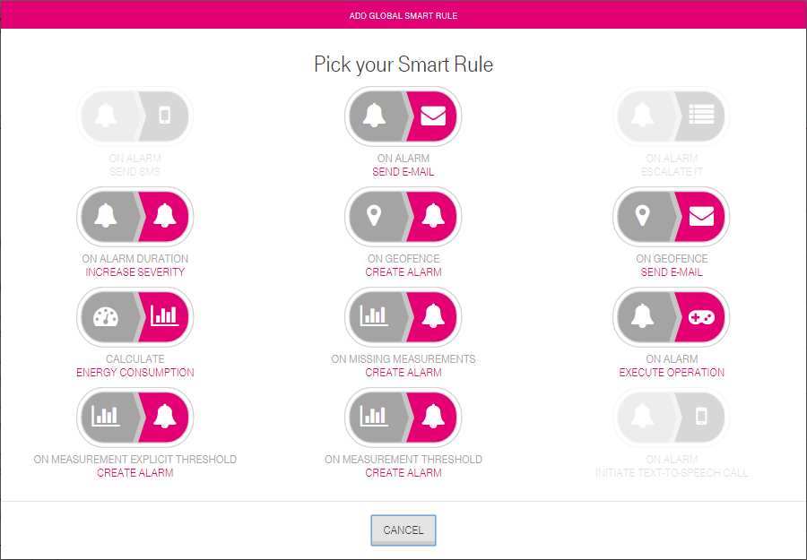
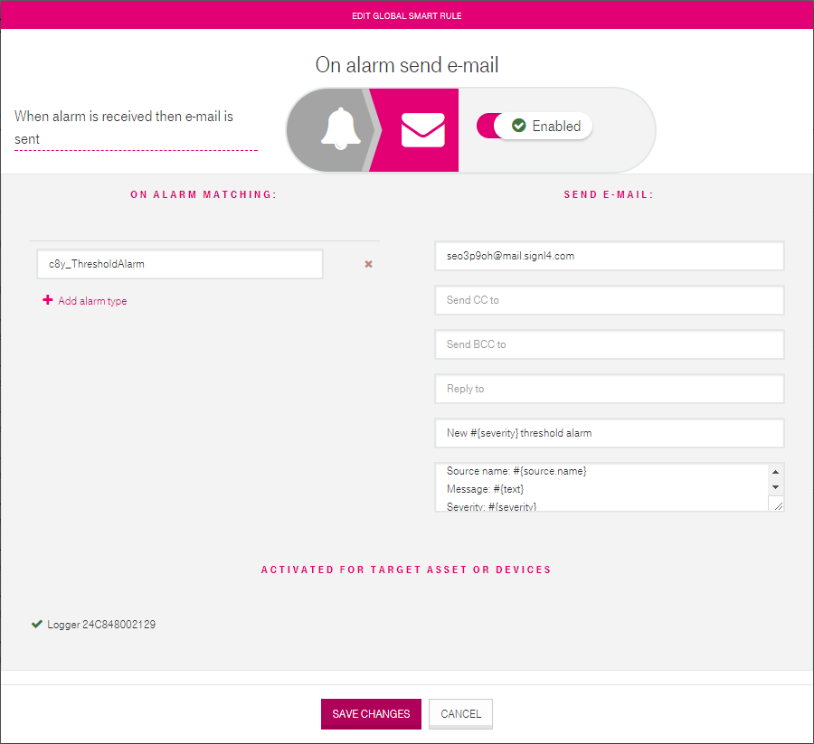

# SIGNL4 Integration with Cumulocity

Mobile workers are not able to sit in front of a [Cumulocity](https://www.cumulocity.com/) IoT dashboard and monitor problems. SIGNL4 works with the Cumulocity IoT Platform to notify people on the ground who are actually responsible for fixing issues that occur during operating hours.

IoT platforms such as [Cumulocity by Software AG](https://www.cumulocity.com/) are a crucial part in a proper "Industry 4.0" implementation. The Deutsche Telekom AG is using Cumulocity for their new IoT products like "Predictive Maintenance" and the "Cloud der Dinge Starterkit".

They are used to connect and organize shop floor machines via the Internet for capturing their data or sending commands down to the devices. One idea at the end is to control and utilize them within a geographically distributed production process (e.g. when they reside in different plants). Another use case, which is typically a little easier to start with, is to get alerts in case of certain machine properties indicate potential problems. Those alarms however, are mostly only available in web dashboards of the IoT platforms which operates against desired mobility of shop floor personnel or mobile field workers.

The solution is to connect the IoT platform with the SIGNL4 application with is described below.

Alarm dashboard of Telekom’s "Cloud of Things" platform (Cumulocity appliance)

## Connecting SIGNL4

In Cumulocity you have defined smart rules for your gateways which generate alarms e.g. when measurements reach explicit thresholds. We will use the Email API of SIGNL4 to get those generated alarms down to SIGNL4 app. Additional Smart Rules, which send emails when certain alarms are created, will be configured to send to the email address of your SIGNL4 team as follows:

1. Log in to the COCKPIT and navigate to a connected gateway device of your choice to open its existing alarm Smart Rules. The green bell icon indicates that these rules generate alarms which are displayed in the web portal. If you do not have any of those rules, you must create some first.  
     
2. Click "Add Smart Rule" and choose "SEND E-MAIL"  
    
3. Configure the new smart rule to match on a desired alarm type (which is created by another existing Smart Rule) and which you want to route to your SIGNL4 team. Enter the email address of your SIGNL4 team in the to field and orchestrate your message.  
    Tip:  
    When you want to embed variables such as the source name (#{source.name}) you may format them as parameter listing as displayed in the image below. You may also format the message of your alarm rules in the same way for an ultimate mobile alerting experience: SIGNL4 contains an intelligent email parser which will identify and isolate the parameters and values for convenient, state of the art display in the SIGNL4 app. Finally, your email smart rule should look similar as in the below image. Click "Save Changes" to create the rule.  
    

## Enjoy mobile IoT alerts

Whenever your email smart rule applies to new alarms in Cumulocity, you’ll receive new alerts in the SIGNL4 app now.  
They will be intelligently associated to a system or device category based on the email content that you have entered in the message field of the smart rule(s). For example, if you have a "Temperature" category in SIGNL4 and you have entered an alarm message similar to "Temperature exceeded 50F" in the smart rule, the corresponding SIGNL4 alerts may look like in the below image:

