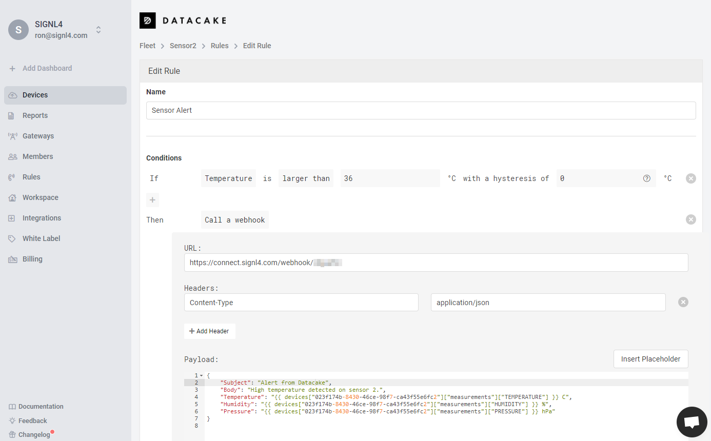

# SIGNL4 Integration with Datacake

For integrating SIGNL4 with Datacake you can create a new rule that sends an HTTP request on certain sensor conditions.

In the Datacake portal under Rules you create a new rule. In your rule you specify the sensor conditions (if) as well as the webhook for the data to be sent to SIGNL4 (then).



In the webhook part you enter your SIGNL4 webhook URL including your SIGNL4 team secret.

The payload is your alert data in JSON format. You can insert placeholders for sensor values here as well.

Once the rule is created you will receive alerts in your SIGNL4 app whenever the sensor condition applies.

**Resolve Alerts**

It is also possible to close existing alerts in SIGN4 if a sensor state it OK or back to normal again. You might want to create one rule for creating the alert in SIGNL4, e.g. if the temperature is too high, and a second rule to close the alert again, e.g. if the temperature is back to normal again.

For the alert trigger rule add the following JSON parameters:
```
"X-S4-ExternalID": "sensor-2",
"X-S4-Status": "new",
```

For the resolve rule add the following:
```
"X-S4-ExternalID": "sensor-2",
"X-S4-Status": "resolved",
```

The parameter "X-S4-ExternalID" must have the same value for alert creation and resolution, e.g. the sensor name.

The alert in SIGNL4 might look like this.


