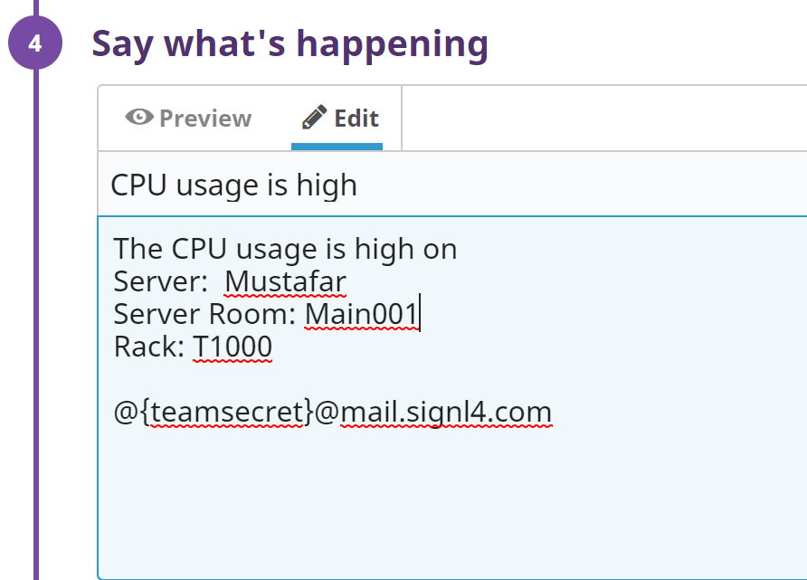

# SIGNL4 Integration with Datadog

[Datadog’s](https://www.datadoghq.com/) monitoring tools have many metrics and graphs.  The limitation is the delivery methods on which that critical information is delivered. Datadog can send an email but that seems to be where the delivery methods stop.

You can find a detailed description on how the webhook integration works [here](https://docs.datadoghq.com/integrations/signl4/). This one supports sending alerts / incidents as well as alert resolutions in case the issue has been resolved on Datadog side.

For incidents status updates in Datadog are supported directly from your SIGNL4 app.

## Datadog Alerts

You can alert your SIGNL4 team about new Alerts in Datadog. Alerts that get resolved in Datadog will automatically close the alert in SIGNL4. In order to do so you need to configure the following.

1. In Datadog, go to Integrations and create a new Webhook integration.

2.Navigate to the Webhooks Integration tile.

3. On the “Configuration” tab, go to “Webhooks” and click “New”.

4. Under “New Webhook”, enter a meaningful “Name” and use this SIGNL4 Webhook “URL” including your team secret, for example:

```
https://connect.signl4.com/webhook/[team-secret]?ExtIDParam=alertId&ExtStatusParam=alertTransition&ResolvedStatus=Recovered
```

Replace [team-secret] with your SIGNL4 team secret here.

5. Copy-paste the following JSON in the “Payload” text box:

```json
{
	"title": "$EVENT_TITLE",
	"message": "$TEXT_ONLY_MSG",
	"link": "$LINK",
	"priority": "$ALERT_PRIORITY",
	"host": "$HOSTNAME",
	"alertScope": "$ALERT_SCOPE",
	"alertStatus": "$ALERT_STATUS",
	"alertId": "$ALERT_ID",
	"alertTransition": "$ALERT_TRANSITION",
	"X-S4-SourceSystem": "Datadog",
	"date": "$DATE",
	"org": {
		"id": "$ORG_ID",
		"name": "$ORG_NAME"
	},
	"id": "$ID"
}
```

You can adapt the parameters according to your need but please leave alertId, alertTransition and X-S4-SourceSystem unchanged.

6. Click on “Save” to complete the webhook creation.

That’s it and now you can use your webhook as a notification channel in your Monitor. You can choose @webhook-SIGNL4 here if SIGNL4 is the name of your webhook. When the conditions of the monitor apply your team will receive a new SIGNL4 alert.


## Datadog Incidents

You can alert your SIGNL4 team about new Incidents in Datadog. Incidents that get resolved in Datadog will automatically close the alert in SIGNL4. In order to do so you need to configure the following.

1. In Datadog, go to Integrations and create a new Webhook integration.

2. Navigate to the Webhooks Integration tile.

3. On the “Configuration” tab, go to “Webhooks” and click “New”.

4. Under “New Webhook”, enter a meaningful “Name” and use this SIGNL4 Webhook “URL” including your team secret, for example:

```
https://connect.signl4.com/webhook/[team-secret]?ExtIDParam=s4ExternalId&ExtStatusParam=incidentStatus&ResolvedStatus=resolved
```

Replace [team-secret] with your SIGNL4 team secret here.

5. Copy-paste the following JSON in the “Payload” text box:

```json
{
	"title": "$EVENT_TITLE",
	"message": "$TEXT_ONLY_MSG",
	"link": "$LINK",
	"priority": "$ALERT_PRIORITY",
	"host": "$HOSTNAME",
	"alertScope": "$ALERT_SCOPE",
	"alertStatus": "$ALERT_STATUS",
	"alertId": "$ALERT_ID",
	"incidentPublicId": "$INCIDENT_PUBLIC_ID",
	"incidentStatus": "$INCIDENT_STATUS",
	"alertTransition": "$ALERT_TRANSITION",
	"s4ExternalId": "DATADOG-INCIDENT-$INCIDENT_PUBLIC_ID",
	"X-S4-SourceSystem": "Datadog",
	"date": "$DATE",
	"org": {
		"id": "$ORG_ID",
		"name": "$ORG_NAME"
	},
	"id": "$ID"
}
```

You can adapt the parameters according to your need but please leave incidentStatus, s4ExternalId and X-S4-SourceSystem unchanged.

6. Click on “Save” to complete the webhook creation.

## Incidents Rule

Now you can create a rule in Datadog under Monitors -> Settings (Incidents) Rules. In the you specify the criteria, i.e. the severity, service, etc. For the “Other attributes” we recommend to use “state:active” that will trigger a new alert and “state:resolved” that will close the alert. Under “Notify” you select your SIGNL4 incident webhook as created above and that’s it.


If you create a new incident now, your SIGNL4 team will receive an alert. If you acknowledge / close the alert in the SIGNL4 app, the incident status will be set to Stable / Resolved.

Also, if you set the incident status to Resolved in Datadog, this will close the alert in SIGNL4.

## Status Updates for Datadog Incidents

For Datadog incidents you can update the status to Stable / Resolved directly from your SIGNL4 app by acknowledging / closing the respective alert.


In order to configure this back channel, go to your SIGNL4 web portal and then to Teams -> Apps. Search for the Datadog connector app and click “Create” there. You can find more information directly within the app settings.

You need to configure the following.

**Datadog URL**: The URL of your Datadog instance, e.g. https://app.datadoghq.com/ or https://app.datadoghq.eu/.

**Datadog API Key**: Your Datadog API key. You can find or create this one in Datadog under your account, Organization Settings -> API Keys.

**Datadog Application Key**: Your Datadog application key. You can find or create this one in Datadog under your account, Organization Settings -> Application Keys.

**Acknowledgement as Stable**: Acknowledgements set the incident status to Stable.

## Alternative Method (Email)

Inside each monitor there is a section to include a message for an alert. Here is where you add the SIGNL4 email address.



The alert in SIGNL4 might look like this.


