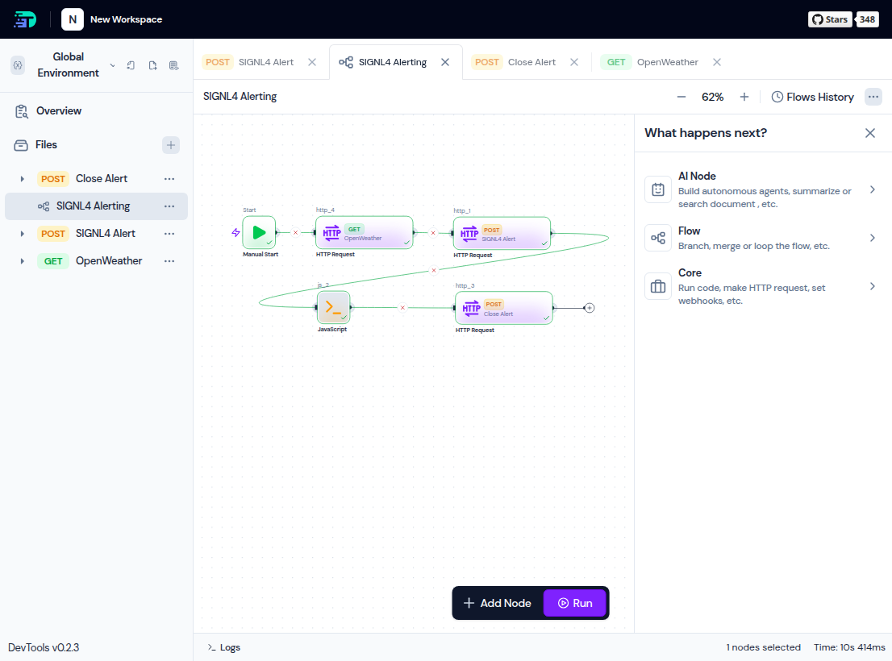

# SIGNL4 Integration with DevTools

[DevTools](https://dev.tools/) is a modern local-first platform for API testing and workflow automation designed to help developers turn real HTTP traffic into structured, CI-ready API workflows. Rather than relying on cloud-hosted services, it focuses on privacy, reproducibility, and Git-native collaboration.

You can use DevTools to implement and test your SIGNL4 API workflows using both the [Webhook API](https://docs.signl4.com/integrations/webhook/webhook.html) and the [REST API](https://connect.signl4.com/api/docs/index.html?urls.primaryName=SIGNL4%20API%20V2).

## Prerequisites

- A SIGNL4 (https://www.signl4.com/) account
- A DevTools (https://dev.tools/) instance

## How to Integrate

If you’re familiar with Postman, the overall concept is quite similar.

You create your requests by defining the URL, headers, and body, and then you can easily test them directly within the tool.

You can then combine these requests into a flow. This allows you to test multi-step processes, for example: first retrieving all SIGNL4 teams, then fetching the users of a specific team, and finally setting a user on or off duty within that team.

A flow in the DevTools looks like this.

The alert in SIGNL4 might look like this.

