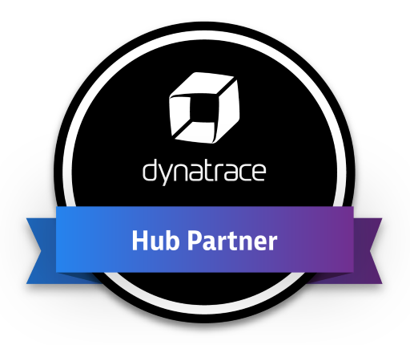

# SIGNL4 Integration with Dynatrace

[Dynatrace](https://www.dynatrace.com/) is an application performance management software company with products for the information technology departments and digital business owners of medium and large businesses. The company’s services include performance management software for programs running on-premises and in the cloud.

## Dynatrace App in SIGNL4

This is the easiest and most powerful (two-way) integration.

In your SIGNL4 portal go to Teams -> Apps and activate the Dynatrace app. Here you just need to enter the mentioned parameters and that’s it. Basically you need the URL of your Dynatrace instance and the API key. All parameters are described more in detail directly in the app settings (click the question mark).

When the setup is complete SIGNL4 will automatically pull new events from Dynatrace and create alerts accordingly.

The integration offers the following features:

- Problems of your choice are polled from Dynatrace automatically
- Option to exclude problems created during maintenance
- Ability to annotate Dynatrace problems from the SIGNL4 mobile app (e.g. by on-call staff)
- Ability to close Dynatrace problems from the SIGNL4 mobile app (e.g. by on-call staff)
- When problems are closed in Dynatrace, the corresponding alerts in SIGNL4 are closed as well

<iframe width="1069" height="568" src="https://www.youtube.com/embed/tbyB4nEGlOs" title="Signl4 and Dynatrace 2 way integration" frameborder="0" allow="accelerometer; autoplay; clipboard-write; encrypted-media; gyroscope; picture-in-picture; web-share" referrerpolicy="strict-origin-when-cross-origin" allowfullscreen></iframe>

## Alternative: One-Way Webhook Integration

If you want a simple one-way integration for sending alerts from Dynatrace to SIGNL4 you can also use webhooks.

You can configure this in your Dynatrace portal under Settings -> Integration -> Problem notifications. Here you can add a new custom notification and enter the SIGNL4 webhook URL including your team secret as Webhook URL. The custom payload contains the JSON date including placeholders. You can leave the default or adapt it to your needs.

To determine when an alert should be sent, you may want to adjust the problem alerting profiles (Settings -> Alerting -> Problem alerting profiles).

The alert in SIGNL4 might look like this.

