# SIGNL4 Integration with EasyVista Service Manager

[EasyVista Service Manager](https://www.easyvista.com/products/it-service-management-software/) is an IT service management (ITSM) solution that helps organizations streamline and automate IT operations, improve service delivery, and enhance user experience through workflows, self-service portals, and ITIL-compliant processes.

SIGNL4 adds reliable mobile alerting to EasyVista Service Manager with features like mobile app, push notifications, SMS messaging, voice calls, automated escalations, and on-call duty scheduling. SIGNL4 ensures that critical alerts reliably reach the responsible personnel – anytime, anywhere.

## Prerequisites

- A SIGNL4 ([https://www.signl4.com](https://www.signl4.com/)) account
- An EasyVista Service Manager ([https://www.easyvista.com/](https://www.easyvista.com/)) instance

## How to integrate

This integration, once setup, will allow for signls to be created in SIGNL4 when a major incident is declared in EasyVista.  Once that incident is later closed, the integration will also close the related signl.

You can adapt the below steps according to your needs.

### Import Steps

In the following steps you import some files. You can find the mentioned files [here](https://docs.signl4.com/integrations/easyvista-service-manager/EasiVista-SIGNL4-Import.zip). It is crucial to import the files in the right order.

1. Perform the imports by first, logging into EasyVista Service Manager, and going to the Administration -> Import / Export -> Import section of the tool  
  a. An easy way to navigate here is by first using the menu on the left, clicking on the gear icon and making sure Global Menu is selected.  
  b. From there, you can simply type in Import into the search bar.  

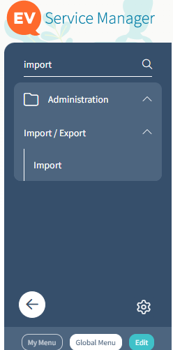

2. Once you click on Import, the Upload a File wizard will pop up on the screen.  
3. Click Choose File and select the file to be imported, then click Upload and finish the wizard.  

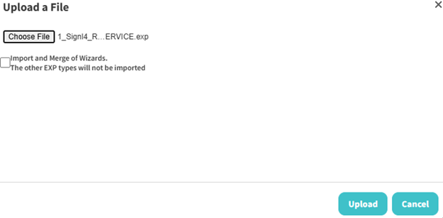

4. Repeat steps 2 and 3 for each file to be imported, till all are imported.  
  a. Note there is a specific order the files should be imported in.  
  b. They have already been numbered, so start with 1, then 2, and so forth, till all 8 have been imported.  
5. Next, go to the Easy Connect -> REST -> Services section of the tool

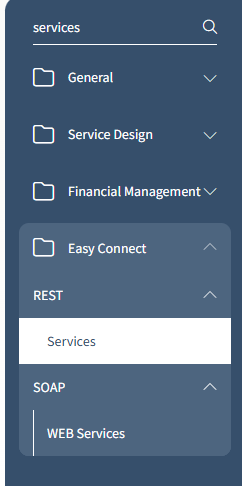

6. Select the magnifying glass icon next to the freshly imported SIGNL4 Service, to edit the REST service and upload the SIGNL4 icon, so the service can have the proper icon, and save.  

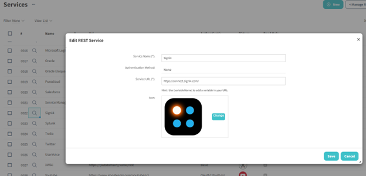

7. Go to the Administration -> Business Rules -> Related Processes section of the tool next.  

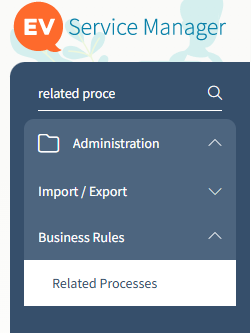

8. Go to the Send Signl on Major Incident Creation item, clicking on the number next to it to edit it. 

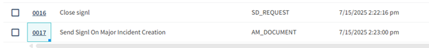

9. Double-click on the Send Signl step of this process and enter your team secret of your SIGNL4 webhook into the webhook variable, so the signl will go to the proper SIGNL4 team.  

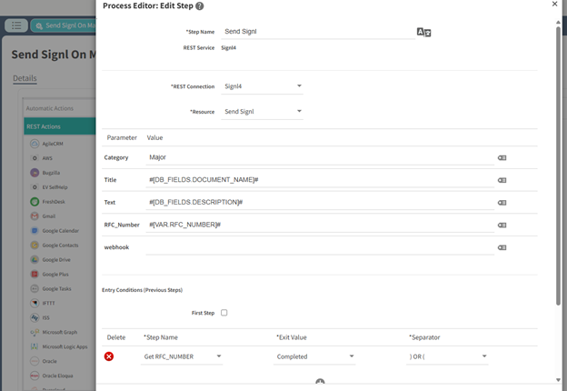

  a. For information on how to get a team secret in SIGNL4, see https://support.signl4.com/hc/en-us/articles/360015827597-Where-is-my-team-secret for details.  
10. Confirm your changes, making sure to save the process afterwards.  
11. Repeat steps 8-10, but for the Close signl process, so that both processes should be saved and have the proper webhook secret from SIGNL4.  

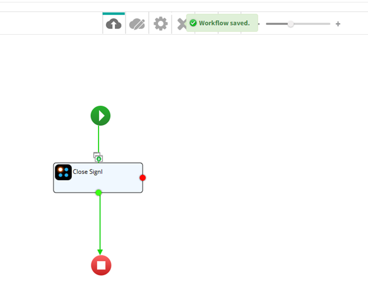

### Test and Incident Creation

1. To create a new incident in EasyVista Service Manager, once you login to the Service Manager, you should see a quick call button at the top of the page.  
2. Once you click on that, a form should display, allowing you to input a Title, Category, and Description for your ticket.  
  a. Note that for Category, you need to select an item under the Incident Catalog, in order for the new ticket to be considered an incident.

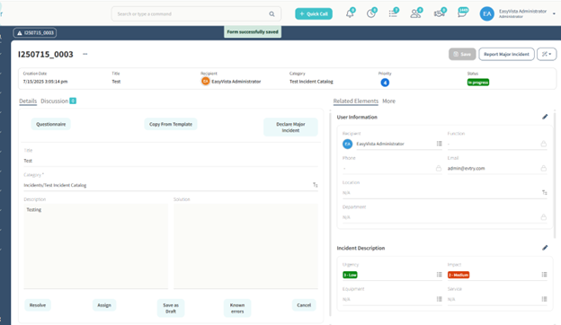

3. Once you fill out the form, use the Assign wizard, answering any questions it asks, to complete the creation of this new incident.  
4. Once created, you can now report this as a Major incident, using the Report Major Incident in the top right side of the page.  
  a. It may be in the dropdown section if you haven’t used it recently.  

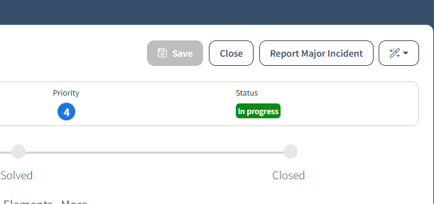

5. Fill out the form and click finish.  

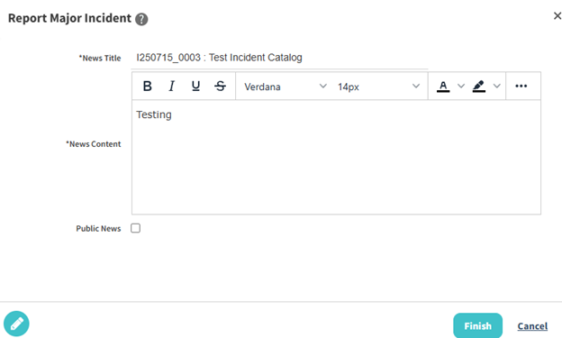

6. This should have triggered the business rule that creates a new signl in SIGNL4, you can go to your SIGNL4 mobile app to the signls to acknowledge.  
  a. Only works if the webhook is configured in the related processes as described above.  
7. The new signl should have the title and description of the major incident that was reported.  
8. To test closing the signl through this integration, now select the close wizard for the same incident you reported as a major incident, filling out the form.  

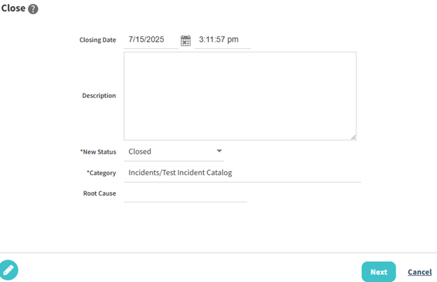

9. Once finished, the status of the incident should now show as Closed.  
10. If you look at the signl in SIGNL4, it should now be closed as well.  

a. Note, like the other process, this close process will only work if configured with the proper team secret as well.  

That's it and the alert in SIGNL4 might look like this.

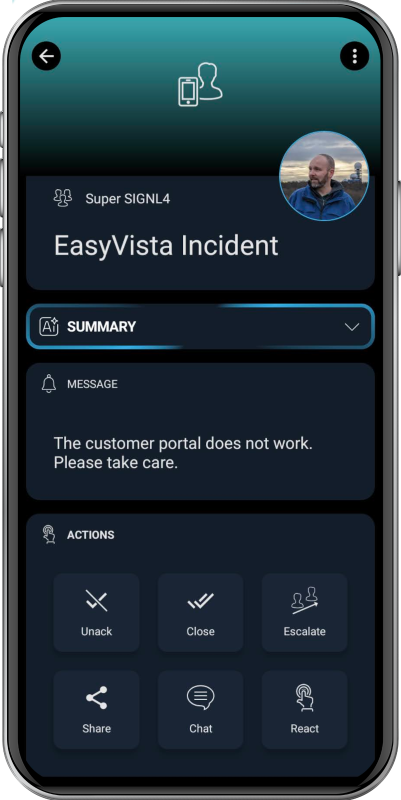
