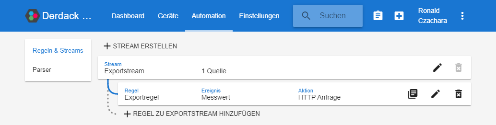
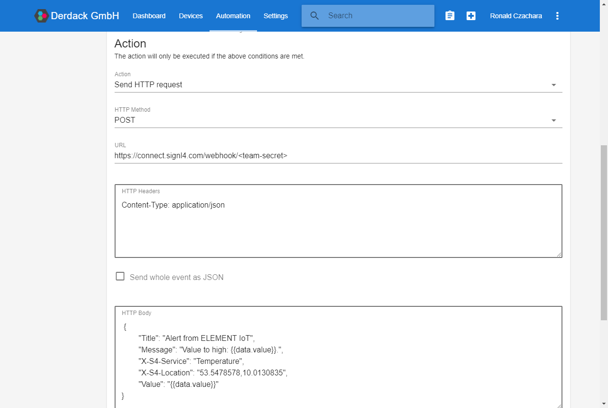

# SIGNL4 Integration with ELEMENT IoT

[ELEMENT IoT](https://zenner-iot.com/element-iot/) is an IoT platform by [Zenner IoT Solutions](https://zenner-iot.com/) for device, network, user and data management.

In our example we use a built-in dummy device to generate random data. We focus on the automation part to send out alerts to a SIGNL4 team when a certain value is out of range.

SIGNL4 is a mobile alert notification app for powerful alerting, alert management and mobile assignment of work items. Get the app at [https://www.signl4.com](https://www.signl4.com/).

## Prerequisites

- A SIGNL4 account ([https://www.signl4.com](https://www.signl4.com/))
- A ELEMENT IoT account ([https://element-iot.com](https://element-iot.com/))

## Connect the Device

In the ELEMENT IoT portal under Devices we create a dummy device that generates random values from 0 to 100. If you already have real devices connected, even better and you can use those.

## Process the Events

Under Automation you can now add a Stream representing the incoming events from your device(s).

Then add a Rules that will forward the relevant events as alerts to your SIGNL4 team.

[

## Rule: Condition 

In the Rule you select the event stream we have created above and choose "Reading added" as Event. This will take the event data already processed by your Parser (if you use one).

As condition you can define when the rule should apply. In our case we choose "data.value>50" to trigger the rule when the value is greater than 50.

## Rule: Action

As Action you can choose "Send HTTP request" and then configure the following data.

HTTP Method: POST

URL: This is your webhook URL including your team secret.

HTTP Headers: Content-Type: application/json

HTTP Body: This is your JSON payload representing the alert data. You can use static values as well as dynamic values coming from the event.

The Action now looks like this.

## Test It

This is it. You can now test your IoT scenario by simulating an appropriate event. You will then receive an alert in your SIGNL4 app.

The alert in SIGNL4 might look like this.

