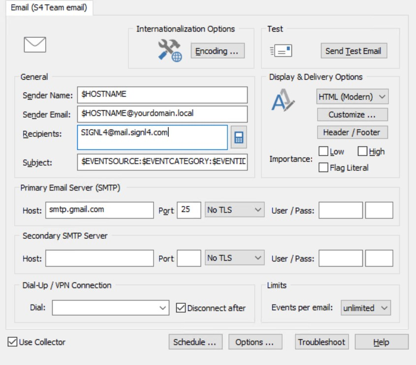
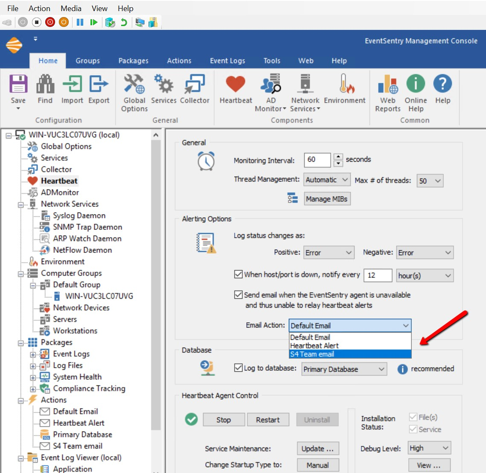
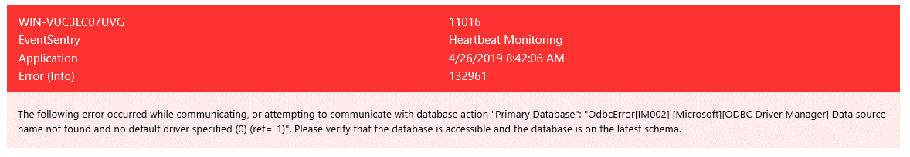

# SIGNL4 Integration with EventSentry

## How to Integrate

[EventSentry](https://www.eventsentry.com/) is a great monitoring tool to receive network analytics, AD monitoring, threat intelligence and more. Alerts are sent via email to designate addresses for alerting purposes.  SIGNL4 takes the email out of the inbox and delivers it straight to your technicians’ smart phones. With on-call scheduling and tiered escalation, you can ensure that critical alerts are not lost in the sea of emails.

Set SIGNL4 team email as an alert action.  Under the Actions menu click on Add Action.

Under **Recipients** put in the SIGNL4 team email address and populate the necessary server information.

Once the test connection has been made successfully, you will see a new option in the monitoring tools for S4 Team email.  Here is an example of how to select this option for the Heartbeat Monitor.

Emails will arrive as follows.

SIGNL4 can easily separate this data into easy to read format within the mobile app.

The alert in SIGNL4 might look like this.

